# 「Operator Learning Seminar」Problem & Solution (2026 Datahub, V1.0.0)

这是一个基于 ETH 的 AI in Science and Engineering (AISE25) 课程，针对 **operator learning** 相关内容做的整理. 借助 AI 把相关 slides 单独抽出来，做成了一套 "带着问题学" 的入门路径，便于初学者了解算子学习.

- 参考资料：[AI in Science and Engineering (AISE25)](https://camlab-ethz.github.io/ai4s-course/fall2025/schedule/).
- 课程官网有录播、讲义、相关论文，以及编程相关的练习题、答案，非常完备.

这份整理把 operator learning 主线整理成 9 个 Problem。每个 Problem 大约 30 min 内可以做完. 且每个 Problem 被拆成一组子问题，引导初学者思考、回答问题，从而对算子学习有更深的认识.

## 学习方式

建议把这份 Problem & Solution 当成讲义，先过一遍 Problem，对大概内容有一个认识，然后进入 Solution，一边翻 slides、一边理解这里答案. 对理解每个 Problem & Solution，建议用时 20 min，然后休息一会再进一步思考.

## Problem

### Problem 1: 我们到底在学什么算子 ($\mathcal{G}$, $\mu$, $\mathcal{G}_{\#}\mu$)？
> **Evidence:** AISE25Lect5.pdf p.17-19，p.25，p.37; AISE25Lect6.pdf p.3，p.15.
**我们要回答什么：**把 "用数据学 PDE" 的任务写成 "学习解算子 $\mathcal{G}$"，并把训练数据、泛化与评估误差的对象说清楚.

**达成标准：**我们能用 $\mathcal{G}:X\mapsto Y$、$\mu\in \mathrm{Prob}(X)$ 与 $(a_i,\mathcal{G}(a_i))$ 的采样方式写出核心数学表述，并能解释 slides 为什么会写 "find approximation to $\mathcal{G}_{\#}\mu$" 以及误差 $\hat{\mathcal{E}}^2$ 的积分结构.

**Socratic prompts：**
1. AISE25Lect5.pdf p.17-18：Darcy/Euler 例子里，输入函数 $a$ 与输出函数 $u$ 分别是什么？把它写成 $\mathcal{G}:a\mapsto u$，并用 1 句话描述 $X,Y$ 各自装的是什么类型的函数.
2. AISE25Lect5.pdf p.19/p.25 与 AISE25Lect6.pdf p.3："$\mu \in \mathrm{Prob}(X)$，draw $a_i\sim\mu$" 在训练数据里对应什么采样过程？如果测试分布变成 $\mu'$，我们实际上是在换哪一条泛化假设.
3. AISE25Lect5.pdf p.19：slides 写 "find approximation to $\mathcal{G}_{\#}\mu$". 这里 $\mathcal{G}_{\#}\mu$ 是什么 (pushforward，输出分布)？为什么这句话不等价于 "我们已经写出了 $\mathcal{G}$ 的显式公式".
4. AISE25Lect5.pdf p.37 / AISE25Lect6.pdf p.15：误差 $\hat{\mathcal{E}}^2$ 为什么要同时对空间变量与输入分布积分？如果只有有限样本与离散网格，这个误差最自然的 empirical 近似是什么.

### Problem 2: 什么叫 "genuine operator learning"，以及它和跨分辨率泛化的关系是什么？
> **Evidence:** AISE25Lect5.pdf p.26-31，p.40; AISE25Lect6.pdf p.4-9，p.18-25; AISE25Lect7.pdf p.3-6.

**我们要回答什么：**当输入/输出只能以离散样本进入计算机时，我们如何区分 "学到了连续算子 $\mathcal{G}$" vs "只学到了某个固定离散表示上的映射 $L:\mathbb{R}^N\to\mathbb{R}^N$"，并解释为什么换网格会暴露出这个差别.

**达成标准：**我们能用 CDE/ReNO 的公式写出 aliasing error $\epsilon(\mathcal{G}, G)=\mathcal{G}-\mathcal{R}\circ G\circ \mathcal{E}$，并能解释 $\epsilon \equiv 0$ 与 "discrepancies between resolutions" 的关系.

**Socratic prompts：**
1. AISE25Lect5.pdf p.26 / AISE25Lect6.pdf p.4：把 "discretize -> learn -> interpolate" 写成 $\mathcal{G}^{*} = \mathcal{R} \circ L^{*} \circ \mathcal{E}$. 如果网格从 $N$ 变到 $N'$，哪一部分最直接导致模型结构不兼容.
2. AISE25Lect6.pdf p.22：在 1D regular grid 例子里，encoding $\mathcal{E}$ 与 reconstruction $\mathcal{R}$ 分别是什么？Nyquist-Shannon 在这里说的 bijection (一一对应) 想表达哪件事 (离散采样不丢信息).
3. AISE25Lect6.pdf p.20-21 / AISE25Lect7.pdf p.3-4：aliasing error $\epsilon(\mathcal{G}, G) = \mathcal{G} - \mathcal{R} \circ G \circ \mathcal{E}$ 在测什么？解释 $\epsilon \equiv 0$ 的含义，并把它与 "Aliasing ⇒ Discrepancies between Resolutions" (AISE25Lect6.pdf p.21) 连接起来.
4. AISE25Lect6.pdf p.20 / AISE25Lect7.pdf p.3：slides 强调这个概念需要逐层 (layerwise) 检查. 结合 $\mathcal{G}=\mathcal{G}_L\circ\cdots\circ \mathcal{G}_1$，逐层检查到底是在检查什么 "可交换/一致性" 条件.
5. AISE25Lect6.pdf p.23-25：CNN 为什么不是 ReNO？FNO 的 convolution kernel 为什么可能是 ReNO 的候选，但 activation 为什么会破坏 bandlimit，从而导致 "not necessarily ReNO".

### Problem 3: 一个 neural operator layer 的基本结构是什么，为什么离散实现会逼迫我们选择特定 kernel 参数化？
> **Evidence:** AISE25Lect5.pdf p.32-34; AISE25Lect6.pdf p.10-12.

**我们要回答什么：**一个 neural operator layer 在数学上基本形式是什么，以及它一旦离散实现，为什么计算复杂度会逼迫我们选择特定的 kernel 结构.

**达成标准：**我们能写出 KIO + bias function + pointwise 非线性 的层形式，并能用 $n$ 个离散点解释朴素实现为何很贵；同时能复述 slides 列出的 kernel 结构家族是在解决 "复杂度" 这个限制.

**Socratic prompts：**
1. AISE25Lect5.pdf p.32-33 / AISE25Lect6.pdf p.10-11：neural operator layer 相比 DNN layer 做了哪 3 个替换？分别对应偏置、线性映射、激活的哪个部分.
2. AISE25Lect5.pdf p.33：把单层写成 $(N_{\ell}v)(x)=\sigma\left(\int_{D}K_{\ell}(x,y)v(y){\rm d}y+B_{\ell}(x)\right)$. 其中哪些是可学习参数.
3. AISE25Lect5.pdf p.34：slides 提醒计算复杂度是主要限制. 如果输入/输出在 $n$ 个点离散，朴素实现 KIO 会出现什么数量级的交互数.
4. AISE25Lect5.pdf p.34：slides 列出 "Low-rank/Fourier/Graph/Multipole ...". 它们分别在试图利用什么结构来降低计算复杂度 (若用到常识补充，需要显式标注 "推断").

### Problem 4: FNO 的 universal approximation 与跨分辨率表现变差为什么不矛盾？
> **Evidence:** AISE25Lect5.pdf p.35-39; AISE25Lect6.pdf p.13-15，p.24-25; AISE25Lect7.pdf p.2，p.7-8.

**我们要回答什么：**Slides 一方面给出 universal approximation，另一方面又说 FNO 不跨分辨率泛化. 我们要解释这两句话为什么不矛盾，并指出中间缺的那块概念是什么.

**达成标准：**我们能复述 universal approximation 的误差定义与假设范围，并能在 CDE/ReNO 语境下说清楚 "理论保证不包含跨表示一致性".

**Socratic prompts：**
1. AISE25Lect5.pdf p.35 / AISE25Lect6.pdf p.13：FNO 为什么要假设 translation-invariant kernel $K(x,y)=K(x-y)$？这如何导向 Fourier space 的实现.
2. AISE25Lect5.pdf p.37 / AISE25Lect6.pdf p.15：复述 universal approximation theorem. 对什么样的 $\mu,\mathcal{G},\varepsilon$ 给出存在性？误差 $\hat{\mathcal{E}}^2$ 的积分结构是什么.
3. AISE25Lect7.pdf p.2 与 AISE25Lect6.pdf p.20-21：FNO 不能跨网格泛化. 这在 CDE/ReNO 里对应哪一个判定不满足或不被保证.
4. AISE25Lect6.pdf p.24-25：为什么说 FNO 的 convolution kernel 可能是 ReNO 的候选，但 activation 会使得 "FNOs are not necessarily ReNOs".
5. AISE25Lect6.pdf p.16; AISE25Lect7.pdf p.17："Random Assignment" 的曲线随 resolution 变化想说明什么风险？我们能从这页得到的结论与不能得到的结论各是什么.

### Problem 5: CNO 为什么是 ReNO，它具体解决了 FNO/CNN 的哪类 aliasing 问题？
> **Evidence:** AISE25Lect7.pdf p.11-16; AISE25Lect8.pdf p.4.

**我们要回答什么：**CNO 具体靠哪些设计把 "跨分辨率不一致" 这件事从经验现象变成可控的结构性质 (ReNO by construction).

**达成标准：**我们能复述 CNO 的两个关键组件 (continuous convolution + alias-aware activation)，并把它们分别对应到 "卷积" 与 "非线性" 这两类 aliasing 风险.

**Socratic prompts：**
1. AISE25Lect7.pdf p.11-12：slides 说 CNO 是 "operator between band-limited functions". 这里 bandlimited 的假设在 CDE/ReNO 语境下解决了什么表示问题.
2. AISE25Lect7.pdf p.12-13 / AISE25Lect6.pdf p.23：对比 CNO 的 continuous convolution 与 CNN 的 discrete convolution，为什么 CNN 被判定为非 ReNO？CNO 的这一块如何避免 resolution dependence.
3. AISE25Lect7.pdf p.14：写出 activation operator $\Sigma = D_{\bar w,w}\circ \sigma \circ U_{w,\bar w}$. 上采样/下采样各自为了解决什么问题？"activation is a ReNO if $\bar w \gg w$" 这句在逻辑上依赖了什么条件.
4. AISE25Lect7.pdf p.15：CNO 为什么用 UNet 结构实例化？把 slides 给出的动机词压缩成 1 句话.
5. AISE25Lect7.pdf p.16：CNO 的两条性质 (ReNO by construction + universal approximation) 分别在什么前提/设定下陈述.

### Problem 6: 我们如何评价 "operator model 做得好"，以及 sample complexity 为什么是主瓶颈 (我们有什么路线提升 data efficiency)？
> **Evidence:** AISE25Lect7.pdf p.19-25，p.30-32; AISE25Lect8.pdf p.5-9，p.14-17，p.24-31，p.33-39; AISE25Lect12.pdf p.3-5，p.14-18，p.39-42，p.45.

**我们要回答什么：**Slides 强调 "success is a curve / histogram, not a point". 我们要把它变成可执行的评估协议，并说明为什么 sample complexity 是瓶颈，以及 slides 给出的两条提升 data efficiency 的路线分别有什么证据链.

**达成标准：**我们能写出 In/Out-of-distribution、resolution sweep、谱行为的核心评估清单，并能复述 $E\sim N^{-\alpha}$ (且 $\alpha$ 很小) 与每个任务需要 $O(10^3)-O(10^4)$ 样本的结论；同时能对比 physics-informed NO 与 Poseidon 在 slides 里给出的证据.

**Socratic prompts：**
1. AISE25Lect7.pdf p.20/p.22/p.24/p.25：任选一个任务，In/Out-of-distribution testing 的差别具体体现在什么 "数据生成设置" 上？把它写成一句可复现的评估协议.
2. AISE25Lect7.pdf p.19/p.23："resolution dependence" 在图上怎么读？对同一页的 "log spectra"，我们能直接读出的差别是什么，不能直接推出的结论是什么.
3. AISE25Lect7.pdf p.30-32 / AISE25Lect8.pdf p.7-9 / AISE25Lect12.pdf p.3：sample complexity 的关键定量结论是什么？它对 PDE 数据生成成本的含义是什么.
4. AISE25Lect8.pdf p.16-17：把 attention 写成 operator. 这个 operator 为什么可以被解释成 "nonlinear kernel neural operator"？它与 FNO/CNO 的 "linear kernel neural operator" 的关键差别是什么.
5. AISE25Lect8.pdf p.24-31：为什么原始 transformer (vanilla transformer) 对 2D/3D 输入不可行？patch 切分 (ViT) 与 windowed attention 分别在复杂度上降低了哪一项.
6. AISE25Lect12.pdf p.4-5：physics-informed NO 的 loss function 长什么样？slides 给出的负面证据 ("not even for simple problems") 指向的主要风险是什么.
7. AISE25Lect12.pdf p.14-18, p.39-42：Poseidon 的 "pretrain + finetune" 证据链怎么复述才不超出 slides？transfer latents vs frozen latents 与 scaling 曲线分别支持了什么结论.

### Problem 7: time-dependent PDE 的 operator learning 目标应如何定义 (连续时间评估)，训练策略如何利用 semi-group 结构？
> **Evidence:** AISE25Lect9.pdf p.4-9，p.12; AISE25Lect12.pdf p.15.

**我们要回答什么：**time-dependent PDE 时，如何把目标写成一个 "连续时间的解算子" 问题，并把训练/推理策略与评估方式对齐 (尤其是 OOD time levels).

**达成标准：**我们能写出 $\mathcal{S}(t,\bar u)=u(t)$ 与半群性质 (semi-group property)，并能说明 autoregressive rollout、time conditioning、all2all training 各自对应什么评估设定与主要风险.

**Socratic prompts：**
1. AISE25Lect9.pdf p.4：写出 solution operator $\mathcal{S}:(0,T)\times X\to X$ 与 $\mathcal{S}(t,\bar u)=u(t)$. 其中 $\mathcal{S}(\Delta t,u(t))=u(t+\Delta t)$ 在这里提供了什么结构.
2. AISE25Lect9.pdf p.6：写出 autoregressive rollout 的公式，并逐条对齐 slides 列出的几个问题点 (uniform spacing, error accumulation, discrete time levels).
3. AISE25Lect9.pdf p.7：time conditioning 的核心做法是什么？lead time 是如何进入模型的，conditional normalization 的哪些量依赖 $t$.
4. AISE25Lect9.pdf p.9：all2all training 的 input-target pairs 写成什么形式？为什么每条 trajectory 可以得到约 $\frac{K^2+K}{2}$ 个样本.
5. AISE25Lect9.pdf p.9/p.12：什么叫 "continuous-in-time evaluations" 与 "OOD time levels"？它和只在离散时间网格上评估相比，差别是什么.

### Problem 8: 从 2D Cartesian domain 走向 arbitrary domains/unstructured grids 时，representation 与 model class 应该怎么选？
> **Evidence:** AISE25Lect10.pdf p.3-4，p.8，p.11，p.17-20; AISE25Lect9.pdf p.24，p.29.

**我们要回答什么：**当 PDE 数据不再是 uniform grid，而是 unstructured mesh / point cloud 时，我们应该如何选输入输出表示与模型类别，并能说清楚每条路线在什么前提下更合理.

**达成标准：**我们能把 masking/DSE/GNN/GAOT/MAGNO 分别对应到数据表示，并能把 accuracy vs efficiency vs scalability 的权衡说成可执行的选型理由.

**Socratic prompts：**
1. AISE25Lect10.pdf p.3：slides 提到的核心限制是什么？为什么之前的讨论隐含了 "Cartesian domain + uniform grids"，现实数据会以哪些形式出现 (unstructured grids, point clouds).
2. AISE25Lect10.pdf p.4：slides 列出的 3 条路线是什么 (masking/DSE/GNN)？它们各自假设输入输出是什么表示.
3. AISE25Lect10.pdf p.8：写出 message passing 的 generic form，并把 $v_i,N_i$ 在 PDE mesh 的语境下各对应什么信息.
4. AISE25Lect9.pdf p.24/p.29 与 AISE25Lect10.pdf p.11/p.17：RIGNO 的目标性质 (multiscale/temporal continuity/resolution invariance) 与主要权衡 (accurate but not efficient) 分别是什么.
5. AISE25Lect10.pdf p.18-20：GAOT/MAGNO 的 encode-process-decode 流程是什么？它试图用 graph + transformer 同时解决什么瓶颈.

### Problem 9: 对 chaotic multiscale PDEs，为什么 "回归一个确定性解算子" 可能目标就不太合适 (应该学 conditional distribution)？
> **Evidence:** AISE25Lect11.pdf p.4-6，p.10-12，p.15-16，p.19-20.

**我们要回答什么：**Slides 展示了 regression model 在 chaotic multiscale PDE 上的失效模式. 我们要复述它给出的原因链条，并说明为什么学习目标会从 "deterministic operator" 推向 "conditional distribution $P(u(t)\mid u_0)$".

**达成标准：**我们能用 2-3 句话把 "collapse to mean" 的现象与原因链条说清楚，并能列出 GenCFD 在 slides 里用哪些指标验证 "分布学对了" 与推理速度.

**Socratic prompts：**
1. AISE25Lect11.pdf p.5/p.15：slides 说 "collapse to mean". 结合后续 mean/variance 页，这个现象在预测输出里最直接的表现是什么.
2. AISE25Lect11.pdf p.5：把 slides 列出的 4 个点 (insensitivity, edge of chaos, spectral bias, bounded gradients) 串成一条推理链，解释它们如何导向 "collapse to mean".
3. AISE25Lect11.pdf p.6：为什么要把目标改成 conditional distribution $P(u(t)\mid u_0)$？这与 Problem 1 的 "$\mathcal{G}_{\#}\mu$ / 输出分布" 视角如何对齐.
4. AISE25Lect11.pdf p.10-12：GenCFD 的训练目标是什么 (conditional score-based diffusion + denoiser objective)？conditioning 里包含哪些变量.
5. AISE25Lect11.pdf p.19-20：slides 用哪些指标验证生成分布的质量与推理速度 (mean/variance, point pdfs, spectra, Wasserstein distance, runtime)？它们各自验证了什么.

## Solution

### Solution 1: 我们到底在学什么算子 ($\mathcal{G}$, $\mu$, $\mathcal{G}_{\#}\mu$)？

> **Evidence:** AISE25Lect5.pdf p.17-19，p.25，p.37; AISE25Lect6.pdf p.3，p.15.

**我们要回答什么：**Slides 把 "解 PDE" 重写成 "学习解算子 $\mathcal{G}$". 这里我们需要把 3 件事说清楚：  

1) $\mathcal{G}$ 的输入输出到底是什么 (尤其是它们都是函数).  
2) 训练数据是怎么来的，$\mu\in \mathrm{Prob}(X)$ 在这里扮演什么角色，分布换成 $\mu'$ 意味着什么.  
3) 误差 $\hat{\mathcal{E}}^2$ 为什么要对空间变量与输入分布同时积分，离散情况下最自然的 empirical 近似是什么.  

**结论：**Operator learning，简单来说可以理解为 4 件事：

- **对象：**一个无穷维算子 $\mathcal{G}:X\to Y$，输入/输出都是函数 (而不是有限维向量).  
- **数据：**输入函数 $a\sim\mu$，观测到监督对 $(a,\mathcal{G}(a))$，我们只在 $\mu$ 的支撑集上学习/评估.  
- **目标：**slides 写 "find approximation to $\mathcal{G}_{\#}\mu$"，意思是当 $a$ 按 $\mu$ 抽样时，我们关心输出 $\mathcal{G}(a)$ 的分布与典型行为；这比 "写出 $\mathcal{G}$ 的显式公式" 更贴近数据驱动场景.  
- **误差：**$\hat{\mathcal{E}}^2$ 本质是 "对输入分布取期望的 $L^2$ 输出误差"，离散时自然用 "样本平均 + 网格求积" 做近似.

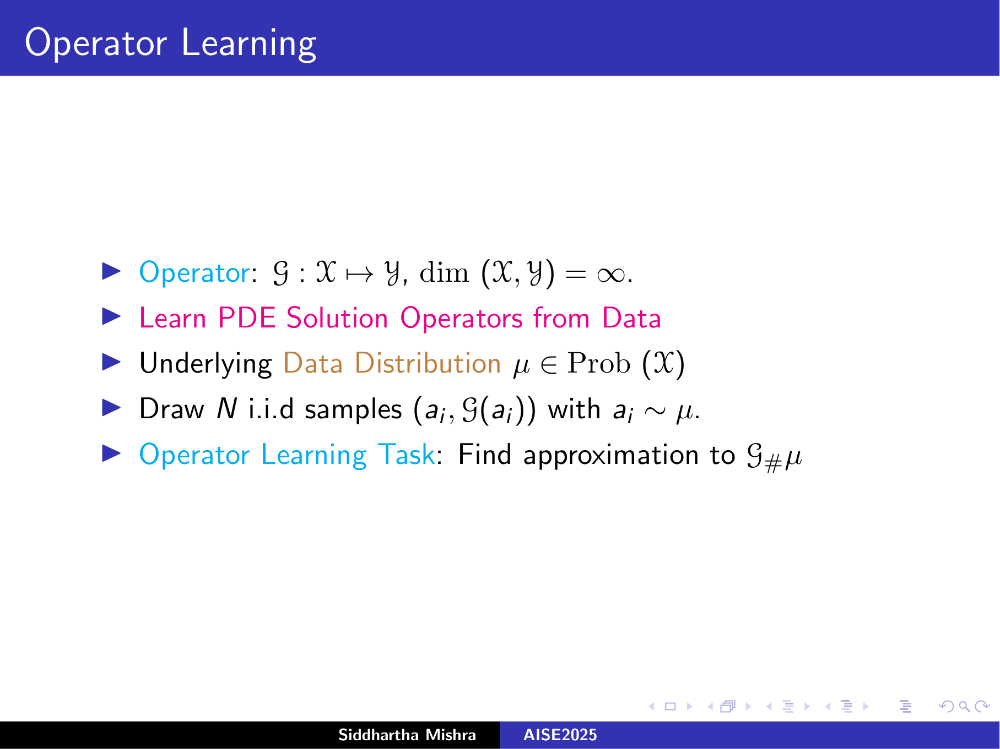

> **Note:** 我们可以把 slides 这里用 $\mathcal{G}_{\#}\mu$ 理解成：我们不打算去推 $\mathcal{G}$ 的公式，而是把它当成一个黑箱算子，用数据学一个可计算的近似；学习与评估的范围由 $\mu$ 决定.

**#1 Darcy/Euler 例子里，输入函数与输出函数分别是什么 (把它写成 $\mathcal{G}:a\mapsto u$).**

Slides 给了两个典型例子来强调 "输入/输出是函数"：

1) **Darcy：**$-\nabla\cdot(a\nabla u)=f$.  
   - 输入：系数场 $a(x)$ (conductance / permeability).  
   - 输出：解场 $u(x)$ (temperature / pressure).  
   - 因而 $\mathcal{G}:a\mapsto u$，其中 $X$ 可以理解为 "一类允许的系数函数 $a(\cdot)$"，$Y$ 是 "对应解函数 $u(\cdot)$" 所在的函数空间.

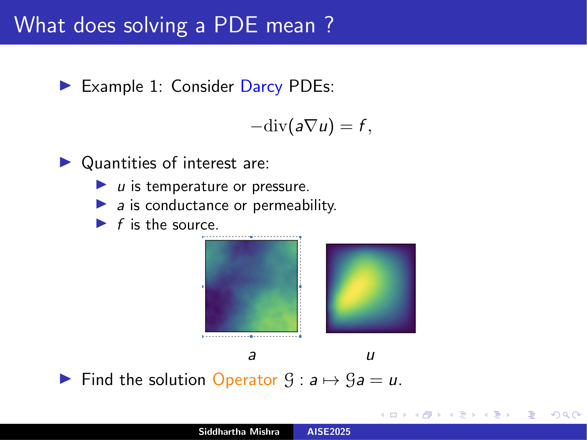

2) **Compressible Euler：**给定初值 $u(x,0)=(\rho,v,E)(x,0)=a(x)$，输出是某个终止时刻 $T$ 的解 $u(T)$.  
   - 输入：初值函数 $a(x)$.  
   - 输出：终止时刻的状态 $u(x,T)$ (slides 写作 $u(T)$).  
   - 因而 $\mathcal{G}:a\mapsto u(T)$. 这里同样是 $X,Y$ 都是函数空间，只是 $Y$ 可以理解为 "时间 $T$ 截面上的状态场".

> **Note:** 这两个例子在形式上都在强调一件事：我们不是在学一个有限维回归 $\mathbb{R}^d\to\mathbb{R}^m$，而是在学 "函数到函数" 的映射.

**#2 $\mu\in \mathrm{Prob}(X)$ 与 $(a_i,\mathcal{G}(a_i))$ 的采样过程在训练数据里对应什么 (以及 $\mu'$ 意味着什么).**

Slides 的数据生成过程是：

- 先规定一个输入函数空间 $X$，并在其上给一个数据分布 $\mu\in \mathrm{Prob}(X)$.  
- 基于 $\mu$ 抽取 $N$ 个 i.i.d. 样本 $a_i\sim\mu$.  
- 对每个 $a_i$，通过 PDE solver 或观测得到 $\mathcal{G}(a_i)$，从而得到监督对 $(a_i,\mathcal{G}(a_i))$.

如果测试分布变成 $\mu'$，我们可以把它理解为：我们在评估一种更强的泛化假设，即模型不仅要在训练分布的典型输入上表现好，还要在另一类输入分布上保持可用. 这在 PDE 语境下常常对应：输入场的统计结构、频率范围、边界条件的分布或几何分布发生了变化.

**#3 $\mathcal{G}_{\#}\mu$ 是什么，为什么 "近似 $\mathcal{G}_{\#}\mu$" 不等价于 "写出 $\mathcal{G}$ 的显式公式".**

$\mathcal{G}_{\#}\mu$ 是 $\mu$ 在算子 $\mathcal{G}$ 下的 pushforward distribution：如果 $a\sim\mu$，那么输出随机变量 $u=\mathcal{G}(a)$ 的分布就是 $\mathcal{G}_{\#}\mu$.

Slides 写 "find approximation to $\mathcal{G}_{\#}\mu$"，我们可以至少从两层含义来读：

1) **范围由 $\mu$ 限定：**我们手里只有从 $\mu$ 抽样来的数据，因此学习与评估的目标默认就是 "在 $\mu$ 的支撑集附近表现好".  
2) **我们关心的是可计算的近似：**在数据驱动场景里，我们不会也不需要写出 $\mathcal{G}$ 的解析表达式；我们需要的是一个模型 $\mathcal{N}$，能在给定输入函数 $a$ 的离散表示后，输出一个近似 $\mathcal{N}(a)\approx \mathcal{G}(a)$，并且在统计意义上覆盖 $\mu$ 下的典型情况.

> **Note:** 说成更直白一点：$\mathcal{G}_{\#}\mu$ 更像是在告诉我们 "你到底要对齐哪一类输入的分布"，而不是在教我们 "怎么把 PDE 解出来".

**#4 误差 $\hat{\mathcal{E}}^2$ 为什么要同时对空间变量与输入分布积分，离散情况下最自然的 empirical 近似是什么.**

Slides 给出的误差形式是：

$$
\hat{\mathcal{E}}^2=\int_X\int_U |\mathcal{G}(u)(y)-\mathcal{N}(u)(y)|^2\,{\rm d}y\,{\rm d}\mu(u).
$$

我们可以把它拆成两层：

1) **内层 $\int_U \cdot\,{\rm d}y$：**这是对空间域 $U$ 的 $L^2$ 误差，也就是衡量两个输出函数在整个空间上的差异，而不是只看某个点.  
2) **外层 $\int_X \cdot\,{\rm d}\mu$：**这是对输入分布的期望，表示我们关心的是在 $\mu$ 下的平均表现.

如果我们只有有限样本与离散网格，那么最自然的 empirical 近似就是：

- 用 Monte Carlo 近似外层期望：$\frac{1}{N}\sum_{i=1}^N$.  
- 用网格求积近似内层积分：例如在网格点 $\{y_j\}_{j=1}^M$ 上做加权和 $\sum_j w_j(\cdot)$.

把两层合起来，可以写成一个非常直观的经验误差形式：

$$
\hat{\mathcal{E}}^2 \approx \frac{1}{N}\sum_{i=1}^N \sum_{j=1}^M w_j\,\big|\mathcal{G}(a_i)(y_j)-\mathcal{N}(a_i)(y_j)\big|^2.
$$

这也解释了为什么 operator learning 的误差通常会同时依赖于 "样本数 $N$" 与 "空间分辨率 $M$"：它本来就在对两件事做平均.

### Solution 2: 什么叫 "genuine operator learning"，以及它和跨分辨率泛化的关系是什么？

> **Evidence:** AISE25Lect5.pdf p.26-31，p.40; AISE25Lect6.pdf p.4-6，p.20-25; AISE25Lect7.pdf p.2-8.

**我们要回答什么：**Slides 在 "Desiderata for Operator Learning" 里写 "Input + Output are functions" 与 "Learn underlying Operator, not just a discrete Representation" (AISE25Lect5.pdf p.31). 同时又把 **discretize-then-learn** 的流程标注为 **"Not possible to evaluate on a Different Resolution" 与 "Not genuine operator learning"** (AISE25Lect5.pdf p.28; AISE25Lect7.pdf p.2). 我们想把这两页放在一起读：什么叫 **"genuine operator learning"**，为什么它会自然牵扯到跨网格/跨分辨率的一致性，以及 slides 用 CDE/ReNO 给出的判定标准是什么.

**结论：**Slides 这里说 **"genuine operator learning"**，简单来说就是两点：**输入与输出是函数**，而且我们想学的是 **underlying operator**，不是某个固定网格上的离散表示 (AISE25Lect5.pdf p.31). 因为我们实际只能通过编码 $\mathcal{E}$ (discretization) 与重建 $\mathcal{R}$ (reconstruction) 来接触这些函数，所以跨分辨率 (换网格) 会变成一个很自然的测试：如果模型学到的是 $L:\mathbb{R}^N\to\mathbb{R}^N$ 这种固定维度的离散映射，那么换 $N$ 时要么直接无法评估，要么出现明显 discrepancy (AISE25Lect5.pdf p.28; AISE25Lect7.pdf p.2). Slides 用 **continuous-discrete equivalence (CDE)** 与 **Representation Equivalent ReNO** 把 "是否真的学到了算子" 写成一个可判定的条件：**在给定 $\mathcal{E}/\mathcal{R}$ 下，离散计算链与连续算子是否 representation equivalent (aliasing error 是否为 0)，并且这个条件要逐层检查** (AISE25Lect6.pdf p.20-21; AISE25Lect7.pdf p.3-4).

> **Note:** 如果一个模型的核心模块只能吃长度为 $N$ 的向量输入 (也就是某个固定网格上的采样值)，它很容易就学成了 "这个 $N$ 维向量到那个 $N$ 维向量" 的映射. 而 "genuine operator learning" 更希望网格只是表示方式，目标对象是函数到函数的 **operator**，所以换一种网格不应让模型的定义或主要结论失效.

> **Definition:** (Aliasing error，AISE25Lect6.pdf p.20-21 / AISE25Lect7.pdf p.3-4) 令 $\mathcal{E}$ 为编码 (discretization)，$\mathcal{R}$ 为重建 (reconstruction)，slides 写
> $$
> \epsilon(\mathcal{G}, G) = \mathcal{G} - \mathcal{R} \circ G \circ \mathcal{E}.
> $$
> 若 $\epsilon \equiv 0$，则称离散表示与连续算子在该表示下是一致的 (representation equivalent).

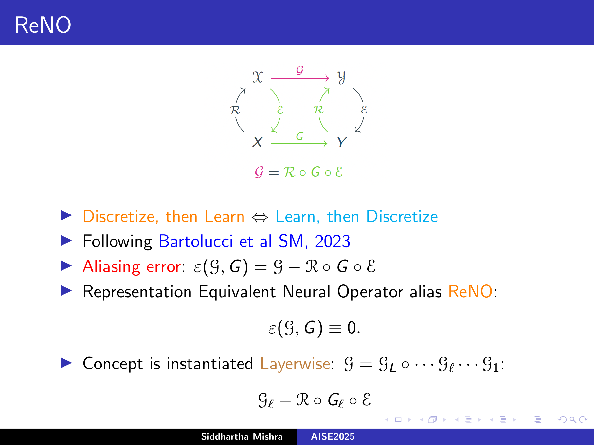

**#1 为什么 discretize-then-learn 往往不是 genuine operator learning.**Slides 给出的 desiderata 是：输入与输出是函数，并且要 "learn underlying operator, not just a discrete representation" (AISE25Lect5.pdf p.31). 但在 discretize-then-learn 的链路里，核心学习对象是固定维度的离散映射 $L^{*}:\mathbb{R}^{N}\to\mathbb{R}^{N}$，因此它天然绑定某个分辨率 $N$，这也是 slides 用 "Not possible to evaluate on a Different Resolution" -> "Not genuine operator learning" 来总结它的原因 (AISE25Lect5.pdf p.28; AISE25Lect6.pdf p.6).

Slides 把 "discretize -> learn -> reconstruct" 写成

$$
\mathcal{G}^{*} = \mathcal{R} \circ L^{*} \circ \mathcal{E}
$$

(AISE25Lect5.pdf p.26; AISE25Lect6.pdf p.4). 其中 $L^{*}$ 的输入输出维度固定在 $\mathbb{R}^{N}$，当网格从 $N$ 变到 $N'$ 时，模型结构就会直接与分辨率绑定.

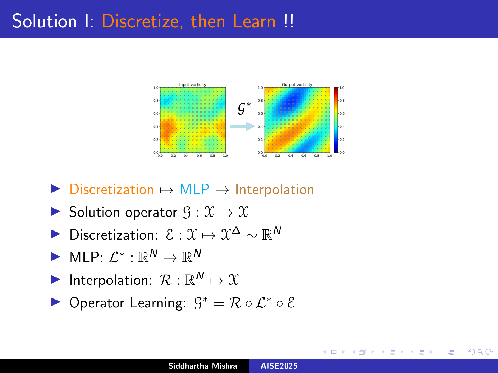

**#2 表示变化的两个组件 $\mathcal{E}$ 与 $\mathcal{R}$.**Slides 给出一个 1D regular grid 的具体例子来说明 $\mathcal{E}/\mathcal{R}$ 的含义 (AISE25Lect6.pdf p.22). 其中 encoding $\mathcal{E}(u)$ 是 pointwise evaluation，而 reconstruction $\mathcal{R}(v)$ 用 **sinc basis** 做重建；**Nyquist-Shannon** 在这里提供的是 **"bandlimited + sufficiently dense grid"** 下的 bijection (一一对应). 换句话说，在这些假设下，采样值 $\mathcal{E}(u)$ 可以唯一确定 $u$，并且可以用 $\mathcal{R}$ 从 $\mathcal{E}(u)$ 重建回 $u$.

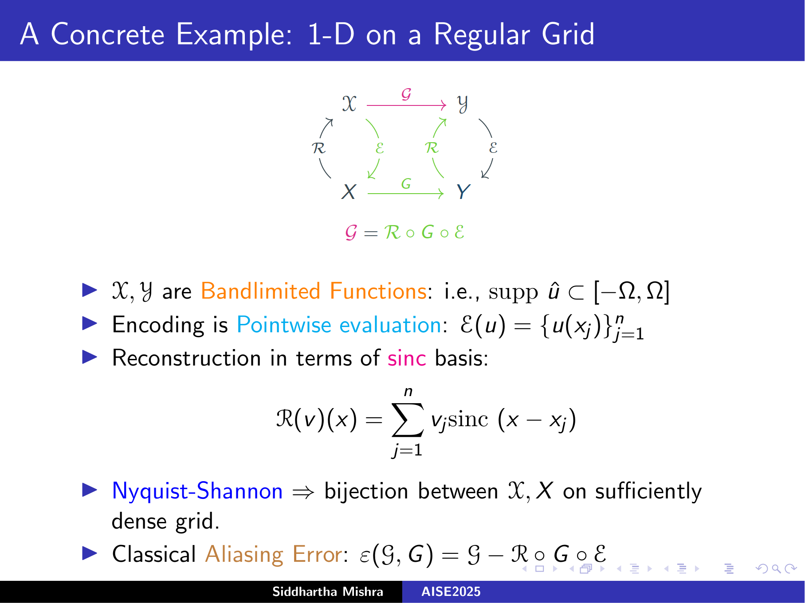

> **Note:** (**bandlimited** function) Slides 在这个例子里把输入和输出的函数空间 $X,Y$ 限制为 bandlimited functions，并用 "supp $\hat u \subset [-\Omega,\Omega]$" 来刻画 (AISE25Lect6.pdf p.22). 简单来说，这等价于 **"函数的细节不含超过某个最高频率"**. 在这个假设下，**如果网格足够密，那么 pointwise sampling 不会丢信息**，sinc reconstruction 可以把离散样本无损重建回原函数 (这也是 slides 写 "Nyquist-Shannon -> **bijection (一一对应)**" 的原因). 反过来，如果不满足 bandlimited 或网格不够密，不同的连续函数可能在网格点上取到相同数值，从而出现 aliasing.

$\mathcal{E}$ 的作用是采样：把连续函数 $u(\cdot)$ 变成离散样本 $\mathcal{E}(u)=\{u(x_j)\}_{j=1}^n$. $\mathcal{R}$ 的作用是重建：把离散样本 $v=\{v_j\}$ 变回连续函数，例如用 sinc 基:

$$
\mathcal{R}(v)(x) = \sum_{j=1}^n v_j \, \mathrm{sinc}(x-x_j).
$$

> **Note:** (**sinc basis**) 这里的 $\mathrm{sinc}(x-x_j)$ 表示以采样点 $x_j$ 为中心的一族基函数. 常见约定有 $\mathrm{sinc}(t)=\sin(\pi t)/(\pi t)$ (normalized) 或 $\mathrm{sinc}(t)=\sin(t)/t$ (unnormalized)，并取 $\mathrm{sinc}(0)=1$. 这一页 slides 未显式写出归一化常数，但无论采用哪种约定，它都对应 **bandlimited** 情况下的理想插值核：$\mathcal{R}$ 把离散样本 $\{v_j\}$ 通过加权求和组合成连续函数，从而和后面的 Nyquist-Shannon 双射结论对齐.

**Nyquist-Shannon 的核心是：如果 $u$ 是 bandlimited 且网格足够密，那么采样与 sinc 重建在理论上可以做到一一对应 (双射)**. 这给了我们一个便于思考的理想化场景：同一函数在不同表示之间可以无损转换. 在这个场景下，我们再去讨论 CDE / ReNO 会更清楚.

**#3 aliasing error $\epsilon$ 在测什么.**$\epsilon$ 衡量 **"连续算子 $\mathcal{G}$" 与 "离散计算链 $\mathcal{R} \circ G \circ \mathcal{E}$" 之间的差异** (AISE25Lect6.pdf p.20-21; AISE25Lect7.pdf p.3-4). 若 $\epsilon \equiv 0$，则表示该计算链与 $\mathcal{G}$ 在该编码/重建下完全一致；slides 在下一页直接把它与 "discrepancies between resolutions" 联系起来 (AISE25Lect6.pdf p.21; AISE25Lect7.pdf p.4).

$\mathcal{R} \circ G \circ \mathcal{E}$ 表示 "先把输入函数离散化，再在离散空间里做运算，最后插值回函数" 的整条离散计算链. 如果把它看作对真实算子 $\mathcal{G}$ 的近似，那么 $\epsilon$ 就是在连续层面衡量 "这条离散链到底偏离了 $\mathcal{G}$ 多少". $\epsilon \equiv 0$ 是一个更严格的一致性要求：在该编码/重建下，离散实现与连续算子一致，因此按这个要求来看，更换表示 (例如网格分辨率变化) 不应额外引入误差来源.

**#4 ReNO 的判定为什么要 layerwise.**Slides 强调这个概念需要逐层 (layerwise) 满足 (AISE25Lect6.pdf p.20; AISE25Lect7.pdf p.3). 对应到 $\mathcal{G} = \mathcal{G}_L \circ \cdots \circ \mathcal{G}_1$ 的分解，直观动机是：端到端误差小并不意味着中间层与表示变换相容；跨网格时新增的 aliasing/discrepancy 往往来自**某一层的非等价实现**.

只看端到端误差时，内部的表示问题可能不太容易看出来：模型可能在某个固定分辨率下把误差做得很小，但中间层的算子并不与表示变换相容，一换网格就会出现新的 aliasing 误差. Layerwise 的好处是把 "是否与表示变化可交换" 这件事落实到具体模块上：哪一层破坏了 bandlimit，哪一层引入了分辨率相关的离散卷积. 在 ReNO 视角下，若每一层都满足 representation equivalence，那么组合后整体更容易保留这种性质，跨分辨率的不一致也更可控.

**#5 CNN / FNO 的关键限制各是什么.**Slides 的对比结论是: CNN 不是 ReNO (AISE25Lect6.pdf p.23; AISE25Lect7.pdf p.6)，FNO 的 kernel 部分在周期 bandlimited 假设下可能是 ReNO，但 **activation 会破坏 bandlimit**，因此 "not necessarily ReNO" (AISE25Lect6.pdf p.24-25; AISE25Lect7.pdf p.7-8).

CNN 的离散卷积基于固定网格索引与离散 kernel，因此分辨率一变就可能出现不一致 (AISE25Lect6.pdf p.23).

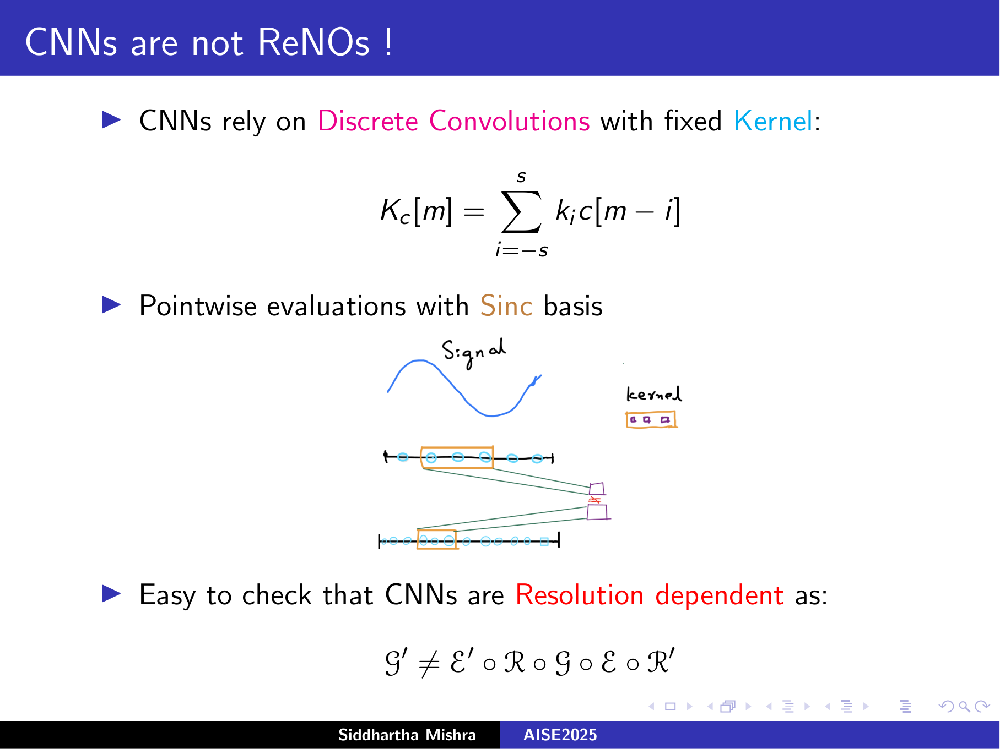

FNO 的 Fourier 卷积在周期 bandlimited 假设下 kernel 部分可保持表示一致性，但 pointwise 非线性 $\sigma$ 会引入高频并打破 bandlimit，从而不一定是 ReNO (AISE25Lect6.pdf p.24-25).

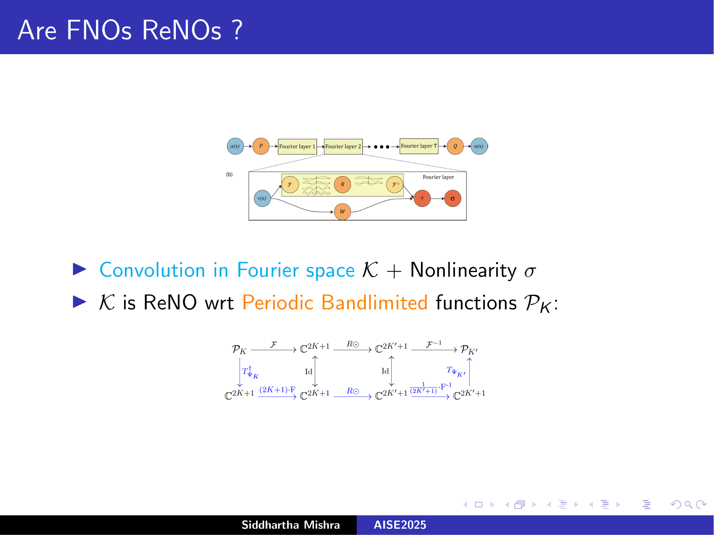

### Solution 3: 一个 neural operator layer 的结构是什么，为什么离散实现会逼迫我们选择特定 kernel 参数化？

> **Evidence:** AISE25Lect5.pdf p.32-34; AISE25Lect6.pdf p.10-12.

**我们要回答什么：**一个 neural operator layer 在数学上长什么样 (它相对 DNN layer 换掉了什么)，以及它一旦在离散网格上实现，为什么会出现很强的计算复杂度压力，逼迫我们把 kernel $K(x,y)$ 做成特定结构 (low-rank / Fourier / graph / multipole 等).

**结论：**一个 neural operator layer，简单来说可以写成

$$
(\mathcal{N}_{\ell}v)(x)=\sigma\left(\int_{D}K_{\ell}(x,y)v(y){\rm d}y+B_{\ell}(x)\right).
$$

它本质上把 DNN layer 的 `bias vector + 矩阵乘法 + 激活`，替换成 `bias function + kernel integral operator + pointwise 激活`. 一旦离散到 $n$ 个点，朴素实现的 kernel integral operator 需要 $O(n^2)$ 级别的两两交互 (以及潜在的 $O(n^2)$ 存储)，因此必须引入带结构的 kernel 参数化来降复杂度 (这是 slides 列出一堆 kernel family 的直接动机).

> **Note:** 这里的关键不是 "把公式写出来"，而是理解为什么 operator layer 的瓶颈天然落在 $K(x,y)$ 的离散计算上：只要它还是一个全局的 pairwise interaction，它就会在网格加密时迅速变得不可用.

**#1 neural operator layer 相比 DNN layer 的 3 个替换.**

回忆一个 DNN 的单层可以写成

$$
\sigma_k(y)=\sigma(A_k y + B_k).
$$

对应地，neural operator layer 的单层是

$$
(\mathcal{N}_{\ell}v)(x)=\sigma\left(\int_{D}K_{\ell}(x,y)v(y){\rm d}y+B_{\ell}(x)\right).
$$

三个替换对应的位置是：

1) **Bias vector -> bias function.** 把 $B_k$ 从一个向量换成函数 $B_{\ell}(x)$，它给每个空间位置 $x$ 一个偏置 (而不是给每个 neuron 一个偏置).  
2) **Matrix-vector multiply -> kernel integral operator.** 把 $A_k y$ 换成对输入函数 $v(\cdot)$ 的积分型线性算子 $\int_D K_{\ell}(x,y)v(y){\rm d}y$，其中 $K_{\ell}(x,y)$ 类似于一个连续域上的 "权重矩阵".  
3) **Activation stays pointwise.** 激活仍然是 pointwise 的：对每个 $x$，对积分结果做 $\sigma(\cdot)$.

对应地，整网路从 $L_{\theta}=\sigma_K\odot\cdots\odot\sigma_1$ 变成 $\mathcal{N}_{\theta}=\mathcal{N}_L\odot\cdots\odot \mathcal{N}_1$，其中每一层 $\mathcal{N}_{\ell}:X\mapsto X$ 都在函数空间里做一次 "线性算子 + pointwise 非线性".

**#2 单层的数学形式与哪些参数是可学习的.**

Slides 直接把单层写成：

$$
(\mathcal{N}_{\ell}v)(x)=\sigma\left(\int_{D}K_{\ell}(x,y)v(y){\rm d}y+B_{\ell}(x)\right).
$$

这里可学习的参数落在两块：
- **Kernel $K_{\ell}(x,y)$.** 它决定了输入函数在不同位置之间如何耦合 (可以是全局、也可以被结构化为某种可快速计算的形式).  
- **Bias function $B_{\ell}(x)$.** 它是位置相关的偏置项.

> **Note:** Slides 在这里的表达非常克制：它只说 "Learning Parameters in $B_{\ell},K_{\ell}$". 这也意味着 kernel 的结构如何选，既是计算问题，也是 inductive bias 的选择问题.

**#3 离散实现为什么很贵 (复杂度从哪里来).**

假设我们把域 $D$ 用 $n$ 个离散点 $\{x_i\}_{i=1}^n$ 表示，并用求积把积分近似成求和. 那么对每个输出点 $x_i$，核积分会变成：

$$
\int_D K_{\ell}(x_i,y)v(y){\rm d}y \approx \sum_{j=1}^n K_{\ell}(x_i,x_j)v(x_j)\Delta x_j.
$$

这一步的朴素计算成本是：
- 对每个 $i$ 都要扫一遍 $j=1,\dots,n$，因此是 **$O(n^2)$ 次交互**.
- 如果 $K_{\ell}(x_i,x_j)$ 需要显式存储或显式计算，通常也会带来 **$O(n^2)$ 的内存或生成成本**.

因此，只要你的网格更细 (更大的 $n$)，这个 layer 的成本会迅速爆炸. 这就是 slides 提醒 "Caveat: Computational Complexity" 的原因.

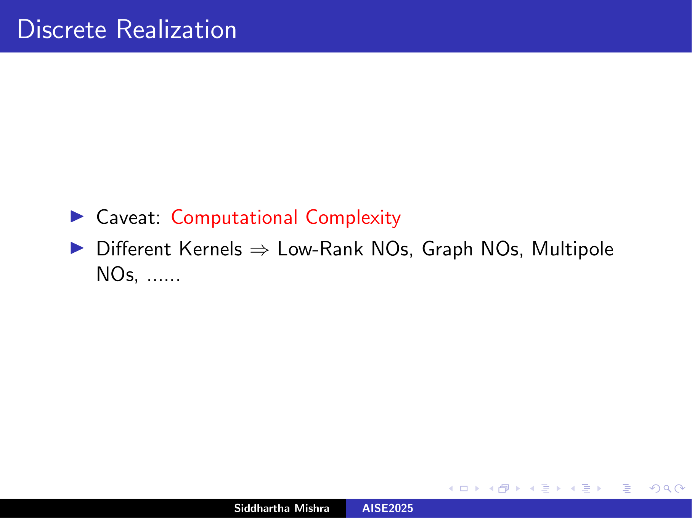

**#4 为什么会出现各种 kernel family (推断：它们在利用什么结构降复杂度).**

Slides 在 "Discrete Realization" 处只给了一个方向性列表 (Different Kernels ⇒ Low-Rank NOs，Graph NOs，Multipole NOs，...). 这背后可以理解为同一个目标：让离散实现从 $O(n^2)$ 降到更可用的量级.

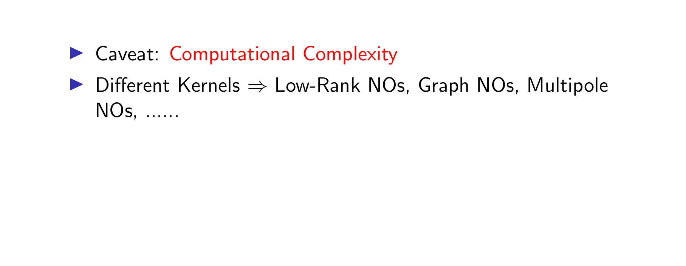

下面是对这些 family 的简要解释 (推断，用于理解计算动机，不把它当作 slides 的原话)：

- **Low-rank kernels：**用低秩分解近似 $K(x,y)\approx \sum_{k=1}^r \phi_k(x)\psi_k(y)$，其中 $\phi_k(\cdot)$ 只依赖 $x$，$\psi_k(\cdot)$ 只依赖 $y$，$r$ 是秩/项数控制参数，从而把全连接的 $n\times n$ 交互压成 $O(nr)$.  
- **Fourier kernels / convolutional structure (FNO 的结构假设)：**FNO 额外增加平移不变条件 $K(x,y)=K(x-y)$. 在这个条件下，核积分变成卷积 $K\ast v$，可用 FFT 在 $O(n\log n)$ 计算.  
- **Graph kernels：**常见做法是把交互限制在图的邻域 (稀疏边集) 上 (例如 message passing)，从而把成本从 $O(n^2)$ 降到随边数增长的 $O(|E|)$.  
- **Multipole / hierarchical kernels：**常见思路是用分组/层次展开去压缩远距离交互，把计算从全局两两交互压到更接近线性复杂度.

> **Note:** 从 "operator layer 的定义" 到 "kernel family 的选择"，中间缺的那块其实就是一句话：**我们想要的算子结构 + 我们能承受的复杂度**. Kernel 参数化是在这两者之间做权衡的方式.

### Solution 4: FNO 的 universal approximation 与跨分辨率表现变差为什么不矛盾？

> **Evidence:** AISE25Lect5.pdf p.35-39; AISE25Lect6.pdf p.13-15，p.24-25; AISE25Lect7.pdf p.2，p.7-8，p.17.

**我们要回答什么：**Slides 一方面说 FNO 有 universal approximation 的理论结果，另一方面又强调 FNO 依然可能不跨分辨率泛化. 这两句话听起来像冲突，但其实中间缺了一个关键概念：**理论的误差定义与假设范围，并不自动包含 "跨表示 (换 grid) 的一致性"**. 我们要把这块缺口补上.

**结论：**Universal approximation theorem 讲的是一个 **存在性** 命题：在给定输入分布 $\mu$ 与目标算子 $\mathcal{G}$ 的前提下，存在某个 FNO 结构 $\mathcal{N}$ 可以把一个定义好的误差 $\hat{\mathcal{E}}$ 做到任意小. 但跨分辨率泛化讨论的是另一件事：当输入/输出函数只能通过编码 $\mathcal{E}$ 与重建 $\mathcal{R}$ 接触时，模型的离散计算链是否与连续算子 **representation equivalent** (CDE/ReNO 视角). FNO 的卷积 kernel 在某些理想假设下可能满足 ReNO，但**pointwise 非线性会破坏 bandlimit**，从而使得 "FNOs are not necessarily ReNOs"，因此换 grid 时出现 discrepancies 并不矛盾.

> **Note:** 我们可以把这件事分成两层问题：  
> (1) 表达能力：有没有能力逼近 $\mathcal{G}$ (universal approximation).  
> (2) 表示一致性：逼近的方式是否与 "换网格/换表示" 可交换 (ReNO).  
> 第 (1) 不自动推出第 (2).

**#1 FNO 为什么要假设 translation-invariant kernel，它如何导向 Fourier space 的实现.**

FNO 从 operator layer 的 kernel integral operator 出发，但额外加了一个结构假设：**平移不变**，

$$
K(x,y)=K(x-y).
$$

这会把核积分

$$
\int_D K(x,y)v(y){\rm d}y
$$

变成卷积 $K\ast v$. 卷积的直接收益是：它可以在 Fourier domain 里变成逐点乘法，因此可以用 FFT 做快速实现. Slides 的表达是把核积分写成

$$
K\ast v = \mathcal{F}^{-1}(\mathcal{F}(K)\mathcal{F}(v)),
$$

并且在 Fourier space 里参数化 kernel，同时截断到固定数量的 Fourier modes，得到可计算的实现.

**#2 Universal approximation theorem 在说什么，它的误差 $\hat{\mathcal{E}}$ 是怎么定义的.**

Slides 给出的表述非常直接：对输入分布 $\mu$ 与目标算子 $\mathcal{G}$，以及任意精度 $\varepsilon>0$，存在一个 FNO 结构 $\mathcal{N}$ 使得误差 $\hat{\mathcal{E}}<\varepsilon$.

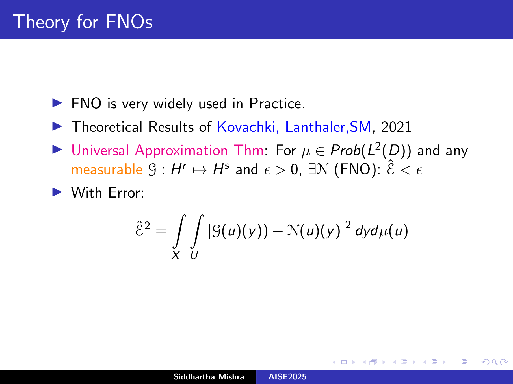

这里的误差是一个 "对输入分布取期望的 $L^2$ 输出误差"，其平方形式是

$$
\hat{\mathcal{E}}^2=\int_X\int_U |\mathcal{G}(u)(y)-\mathcal{N}(u)(y)|^2\,{\rm d}y\,{\rm d}\mu(u).
$$

这个定义在直觉上对应：按 $\mu$ 抽样得到一个输入函数 $u$，看模型输出 $\mathcal{N}(u)$ 与真实输出 $\mathcal{G}(u)$ 在空间域 $U$ 上的 $L^2$ 距离，然后再对 $\mu$ 做平均.

> **Note:** 这里我们只强调一个点：这是 **存在性** + **误差定义**. 它没有承诺训练一定找到这个 $\mathcal{N}$，也没有承诺 $\mathcal{N}$ 在换一种表示方式后仍然与同一个连续算子保持一致.

**#3 为什么 universal approximation 不等价于 "跨分辨率泛化一定好".**

跨分辨率泛化的问题，本质上来自一个现实约束：计算机里输入/输出永远是离散的，我们只能通过

- 编码 (discretization) $\mathcal{E}$ 把连续函数变成离散表示，  
- 再通过重建 (reconstruction) $\mathcal{R}$ 把离散表示还原成连续对象或可比较的输出.

CDE/ReNO 的核心就是把 "换表示 (换 grid)" 变成一个可判定的一致性要求：离散计算链是否与连续算子在该 $\mathcal{E}/\mathcal{R}$ 下相容. 也就是说，除了端到端误差小以外，我们还关心模型内部是否引入了与分辨率强绑定的 aliasing / discrepancy.

Universal approximation theorem 并没有把这件事写进假设或结论里，因此它不可能自动推出 "跨 grid 一定泛化好". 这不是理论错了，而是它回答的问题不同：它回答的是 **表达能力**，不是 **表示一致性**.

**#4 在 ReNO 视角下，FNO 的 kernel 与 activation 各自的问题.**

Slides 对 FNO 的拆法是：**Fourier space 的卷积 kernel $K$ + pointwise 非线性 $\sigma$**.

在理想化设定下，如果我们把函数空间限制为周期且 bandlimited 的函数类 $P_K$，那么卷积这一部分更容易与表示变化相容 (直觉上，这是因为 Fourier modes 的截断与卷积结构给了一个更 "可控" 的线性算子).

但问题出在 pointwise 非线性：非线性 $\sigma$ 会把一个 bandlimited 的函数映射到一个可能不再 bandlimited 的函数. 一旦 bandlimit 被打破，后续离散表示就会出现 aliasing 风险，跨分辨率的一致性也就不再被保证. 这就是 slides 用一句话总结 "FNOs are not necessarily ReNOs" 的关键原因.

**#5 "Random Assignment" 的曲线随 resolution 变化在提醒什么风险 (以及它不能说明什么).**

Slides 用一个 synthetic 的 "Random Assignment" 例子画了 "Discrete Aliasing Error (%) vs Resolution" 的曲线，想强调的风险是：**如果一个模型不是 representation equivalent，那么它在某个固定分辨率上看起来表现不错，并不意味着换一个分辨率仍然可信**. 分辨率变化会把隐藏的 aliasing / discrepancy 放大出来.

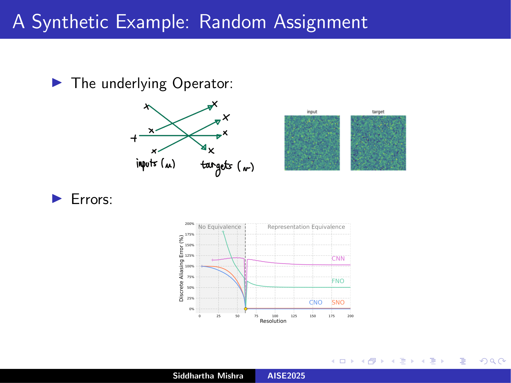

同时，这页图也有明显的边界：
- **它能说明的：**这是一个用来检验表示一致性的合成例子，核心信息是 "换分辨率会暴露 representation inconsistency".  
- **它不能直接说明的：**它不等价于对真实 PDE 任务的最终结论，也不能单凭这一页就推出某个模型在所有任务上必然更好；它更像是在告诉我们：跨分辨率泛化需要额外结构保证 (例如 ReNO 的构造性约束)，而不是只靠 universal approximation 这种存在性表述.

### Solution 5: CNO 为什么是 ReNO，它具体解决了 FNO/CNN 的哪类 aliasing 问题？

> **Evidence:** AISE25Lect7.pdf p.11-16; AISE25Lect8.pdf p.4.

**我们要回答什么：**我们想要的是 "跨分辨率一致" 这件事不仅是经验现象，而是被结构保证 (ReNO by construction). 用 slides 的话说，CNO 把一个 neural operator 的两块高风险源头拆开处理：
1) 卷积算子本身如何做到 representation equivalent.
2) pointwise 非线性为什么会打破 band limit，引入 aliasing (以及 CNO 怎么处理).

**结论：**CNO，简单来说就是做两件事：

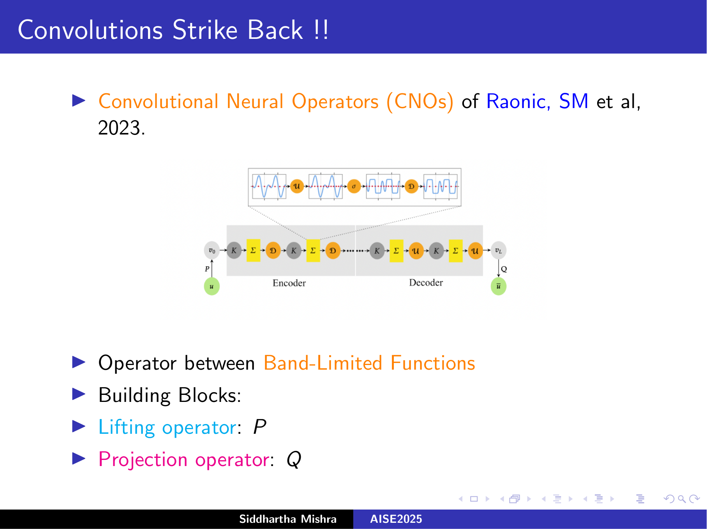

1) **Continuous convolution (在 bandlimited 函数空间上定义).** 卷积核在实现上仍然是离散参数，但卷积算子被定义成对 bandlimited 函数的连续算子，因此它可以被构造成 ReNO，而不是像 CNN 那样被网格索引绑定.  
2) **Alias-aware activation (上采样 -> 非线性 -> 下采样).** pointwise 非线性会产生高频并打破 band limit. CNO 用
$$
\Sigma = D_{\bar w,w}\circ\sigma\circ U_{w,\bar w}
$$
把激活变成一个 "先扩带宽、再做非线性、再做抗混叠下采样" 的算子，从而把非线性带来的 aliasing 风险变成可控条件 (在 $\bar w\gg w$ 的设定下，activation 也可以满足 ReNO 的一致性要求).

> **Note:** 直觉上，CNO 的路线是：先把讨论限定在一个 "表示可控" 的函数类里 (bandlimited)，再分别把线性算子与非线性算子做成和表示变化相容的形式. 这样跨分辨率 discrepancy 不再是 "希望它别发生"，而是 "结构上尽量不允许它发生".

**#1 为什么 CNO 要强调 "operator between band-limited functions"，这个假设在 CDE/ReNO 语境下解决了什么问题.**

在 CDE/ReNO 的语境下，我们永远绕不开 $\mathcal{E}/\mathcal{R}$：连续对象必须被采样 (encoding) 才能进计算机，离散结果也必须被重建 (reconstruction) 才能和连续算子对齐比较. Bandlimited 的假设提供了一个关键便利：在理想化条件下，采样与重建可以被当作 "信息不丢失" 的表示变化，这样我们才能更认真地讨论 "离散实现是否真的在学算子，而不是学某个固定网格上的离散映射".

因此，CNO 把工作空间限定在 bandlimited 函数类上，可以理解为先把 "表示变化本身就会丢信息" 这种不可控因素移出讨论范围，把注意力集中到：模型内部的卷积与非线性是否引入了额外的 aliasing.

**#2 Continuous convolution vs discrete convolution：为什么 CNN 被判定为非 ReNO，CNO 如何避免 resolution dependence.**

Slides 对 CNN 的批评是：CNN 用的是 **离散卷积**，卷积核 $K_c[m]$ 与网格索引绑定；当我们改变表示 (换一种 grid / 分辨率) 时，这个离散算子通常不与 $\mathcal{E}/\mathcal{R}$ 可交换，因此会出现 resolution dependence.

> **Note:** 这里的 "可交换"，指的是 "换表示" 与 "做卷积" 的先后顺序不应该影响结果：如果我们有两套表示 (两张网格) 之间的转换 $\mathcal{E},\mathcal{R}$，那么在新网格上做离散卷积 $\mathcal{G}'$，应该等价于 "先转换到旧网格 -> 用旧网格的离散卷积 $\mathcal{G}$ -> 再转换回新网格". 如果这两条路径对不上，就意味着卷积算子依赖分辨率.

Slides 用一个不等式把这种不相容性写得很具体 (AISE25Lect7.pdf p.13)：

$$
\mathcal{G}' \neq \mathcal{E}' \circ \mathcal{R} \circ \mathcal{G} \circ \mathcal{E} \circ \mathcal{R}'.
$$

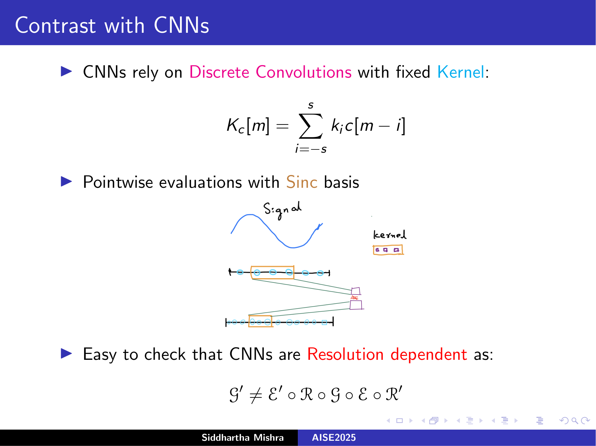

CNO 的做法是把卷积算子提升回连续层面：我们仍然可以用离散参数表示 kernel，但卷积被定义为对 bandlimited 函数的 **continuous convolution**. 在这种构造下，卷积算子本身被宣称为 ReNO，这就从结构上把 "卷积导致的跨分辨率不一致" 这个风险压下去.

**#3 Activation operator $\Sigma$ 在做什么，上采样/下采样各自为了解决什么问题，为什么需要 $\bar w \gg w$.**

非线性 $\sigma$ 的问题是：即使输入是 bandlimited 的，$\sigma(f)$ 也可能不再 bandlimited. 这会把 aliasing 风险引入到后续的离散表示里.

CNO 的策略是把激活改写成一个算子：

$$
\Sigma = D_{\bar w,w}\circ\sigma\circ U_{w,\bar w}.
$$

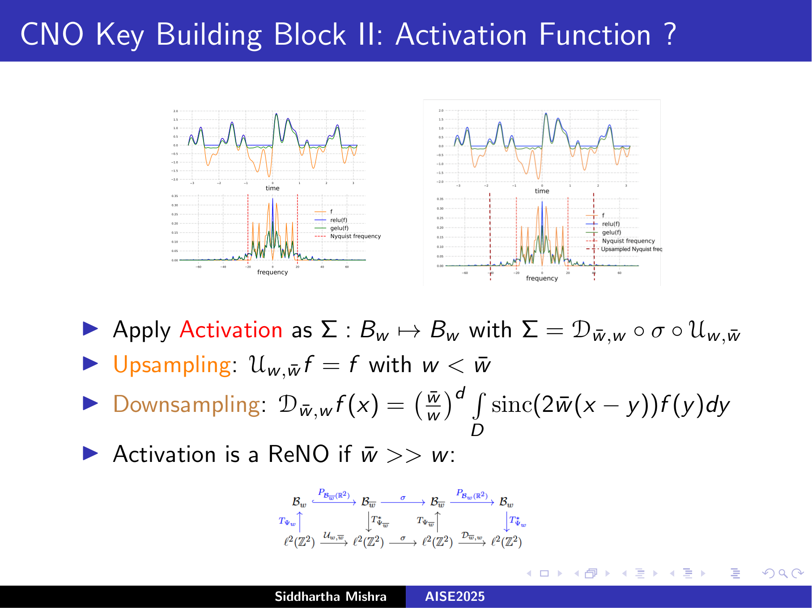

> **Note:** Slides 还给了一个非常具体的 downsampling 形式 (用 sinc 做抗混叠投影)：
> $$
> D_{\bar w,w}f(x)=\left(\frac{\bar w}{w}\right)^d\int_D \mathrm{sinc}(2\bar w(x-y))f(y)\,{\rm d}y.
> $$
> 这里我们可以把它理解成：先在更高带宽里做非线性，再用一个 "带限滤波 + 投影" 把结果压回目标带宽.

对应的直觉分解是：

1) **Upsampling $U_{w,\bar w}$：**先把带宽从 $w$ 提到更高的 $\bar w$，给非线性 "预留频谱空间".  
2) **Apply nonlinearity $\sigma$：**在更高带宽的表示里做 pointwise 非线性.  
3) **Downsampling $D_{\bar w,w}$：**再把结果带宽压回 $w$，并且用带有 sinc 核的方式做一个抗混叠的投影/滤波.

为什么需要 $\bar w \gg w$：因为非线性会产生更高频成分. 如果 $\bar w$ 不够大，那么这些高频会立刻折叠回低频 (aliasing). 当 $\bar w$ 足够大时，非线性产生的高频更可能被 "暂时容纳"，再通过下采样时的滤波更可控地回到 $B_w$. Slides 用一句话把它总结为：在 $\bar w \gg w$ 的设定下，activation 可以被视为一个 ReNO.

**#4 为什么 CNO 用 UNet 结构实例化 (把动机压缩成 1 句话).**

Slides 的动机词是 "Built for multiscale information processing". UNet 的编码器-解码器结构天然在做多尺度信息的提取与融合，因此它适合承载 CNO 这种以 "频谱/分辨率一致性" 为核心约束的 operator 架构.

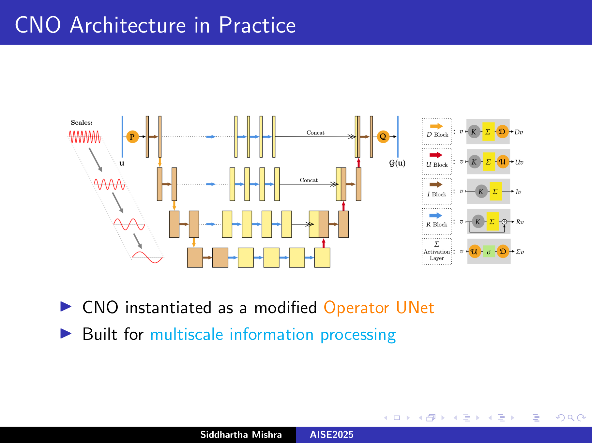

**#5 CNO 的两条性质分别在什么前提下陈述.**

Slides 给出的两个性质是：

1) **ReNO by construction：**在它的构造假设下 (工作在 bandlimited 函数类上，并用 continuous convolution + alias-aware activation)，CNO 被设计成 representation equivalent 的 neural operator.  
2) **Universal approximation：**CNO 给出一个 universal approximation 方向的表述：它可以逼近某一类连续算子 $\mathcal{G}:H^r\to H^s$. Slides 还提示证明的关键是把目标算子在 bandlimited 空间之间做近似构造 (例如 $\mathcal{G}\approx \mathcal{G}^*:B_w\to B_{w'}$)，从而把逼近问题落到更可控的函数类上.

### Solution 6: 我们如何评价 "operator model 做得好"，以及 sample complexity 为什么是主瓶颈 (我们有什么路线提升 data efficiency)？

> **Evidence:** AISE25Lect7.pdf p.19-25，p.30-32; AISE25Lect8.pdf p.5-9，p.14-17，p.24-31，p.33-39; AISE25Lect12.pdf p.3-5，p.14-18，p.39-42，p.45.

**我们要回答什么：**Slides 强调评估结果更像一条 curve 或一个 histogram，而不是一个 point. 我们要把这句话变成可执行的评估协议，并说明为什么 sample complexity 是 operator learning 的硬瓶颈，以及 slides 给出的两条提升 data efficiency 的路线分别是什么、证据是什么.

**结论：**简单来说就三句话：

1) **评估不是一个数字，而是一组多方面的测试.** 至少要同时看：In/Out-of-distribution (zero-shot) 测试、resolution sweep (跨网格)、spectral behavior (log spectra).  
2) **sample complexity 是主瓶颈，因为 scaling 太慢且每个任务需要的大样本太贵.** Slides 用 $E\sim N^{-\alpha}$ (且 $\alpha$ 很小) 来概括误差随样本增长的缓慢下降，并给出每个任务通常需要 $O(10^3)$ 到 $O(10^4)$ 条训练样本的量级，这对 PDE 数据生成是很不友好的.  
3) **提升 data efficiency 的两条路线：**
   1) **physics-informed neural operators**. 把 PDE residual 加进 loss，但 slides 给出负面证据 "not even for simple problems".  
   2) **foundation model / pretrain + finetune**. 以 Poseidon 为例，用 scOT backbone 做大规模预训练，再迁移到下游任务；transfer latents 与 scaling 曲线给出 "预训练确实学到可迁移结构" 的证据.

**#1 In/Out-of-distribution testing：用 Poisson 例子写一条可复现协议.**

我们选 slides 里的 Poisson 例子把 protocol 写清楚：

- **PDE：**$-\Delta u=f$.  
- **目标算子：**$\mathcal{S}:f\mapsto u$.  
  - **数据分布：**Slides 里把 $f$ 写成一组正弦基的随机线性组合，并用一个频率截断参数 $K$ 控制 "最高频"：
  $$
  f \sim \sum_{i,j=1}^K \frac{a_{ij}}{(i^2+j^2)^\alpha}\sin(i\pi x)\sin(j\pi y),\qquad a_{ij}\sim U[-1,1].
  $$
  训练时固定一个 $K_{\rm train}$，测试时用 $K_{\rm test}$ 来定义 in-distribution 或 out-of-distribution.  
- **In-distribution testing：**$K_{\rm test}=K_{\rm train}$.  
- **Out-of-distribution (zero-shot) testing：**用更高的频率截断 $K_{\rm test}>K_{\rm train}$，也就是让测试集包含更高频的 source，从而逼迫模型面对更细的结构.  
- **指标：**对测试集计算相对误差 (slides 用百分比展示)，并且最好同时给出误差分布 (histogram) 或随样本量变化的 curve，而不是只报一个均值.

这个例子里 slides 还把 $K$ 具体化为: in-distribution 用 $K=16$，out-of-distribution 用 $K=20$. 对应的 test errors (相对误差) 是：

- **In-distribution：**FFNN 5.74%，UNet 0.71%，DeepONet 12.92%，FNO 4.78%，CNO 0.23%.  
- **Out-of-distribution：**FFNN 5.35%，UNet 1.27%，DeepONet 9.15%，FNO 8.89%，CNO 0.27%.  

直觉上，这件事在回答：模型到底是在 "背训练分布的频率范围"，还是在学更接近算子层面的规律.

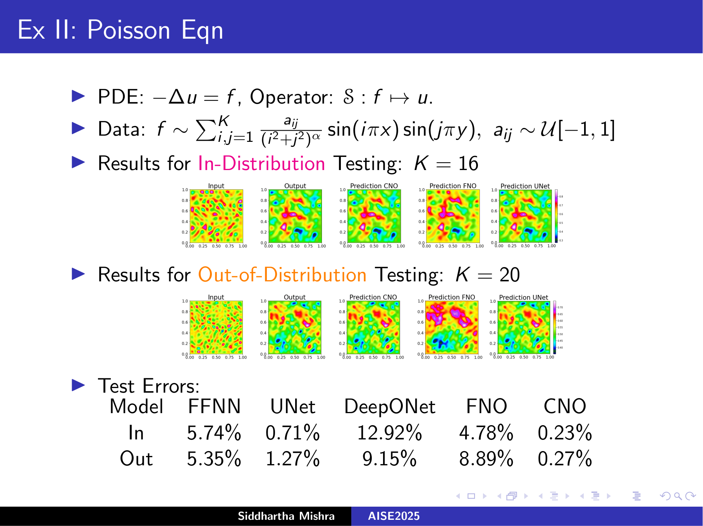

**#2 "Success is a histogram / curve rather than a point"：这句话在评估里怎么落地.**

如果我们只报一个 test error，很容易把不稳定性与长尾掩盖掉. 更具体地说：

- **用 histogram 看长尾：**同一个模型在不同样本/不同输入上可能差异巨大，median 可能好看但 worst-case 很差.  
- **用 curve 看 scaling：**把误差画成随训练样本数 $N$ 变化的曲线，才知道模型是否真的在 "继续变好"，还是早早进入平台期.  

这两件事一旦落到 operator learning，会自然逼出下面两类测试，分别是 resolution sweep 与 spectral behavior.

**#3 Resolution dependence + log spectra：能直接读出的结论与不能直接推出的结论.**

Slides 在 "Further Results" 里把两件事并列：

1) **Resolution dependence：**同一个输入在不同网格分辨率上评估，误差是否显著变化.  
2) **Spectral behavior (log spectra)：**把预测解与真值的频谱 (能量随频率的分布) 放在一起看，检查模型是否系统性丢失高频 (常见表现是过度平滑).

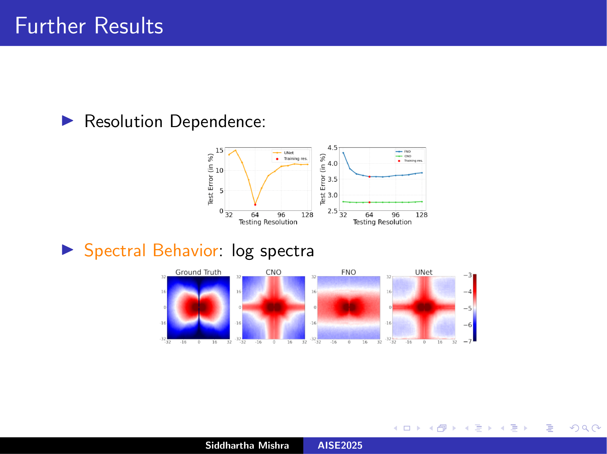

我们可以把这两种图的读法总结成：

- **能直接读出的：**有没有明显的 resolution sensitivity；有没有明显的频谱偏差 (例如高频能量被系统性压掉).  
- **不能直接推出的：**不能仅凭频谱或分辨率曲线就断言 "模型一定更稳定/更物理"；也不能直接把原因归咎为 aliasing、训练不足或网络结构，需要结合 controlled experiments 才能定位.

**#4 sample complexity：为什么说它是主瓶颈.**

Slides 给了一个明确的结论链：

- **Scaling 很慢：**$E\sim N^{-\alpha}$，并且 $\alpha$ 很小.  
- **每个任务要大样本：**每个 PDE operator learning task 往往需要 $O(10^3)$ 到 $O(10^4)$ 条训练样本.  
- **PDE 数据很难搞：**生成一条高质量轨迹/样本的成本不低，因此 "多收集数据" 不是一个轻松选项.

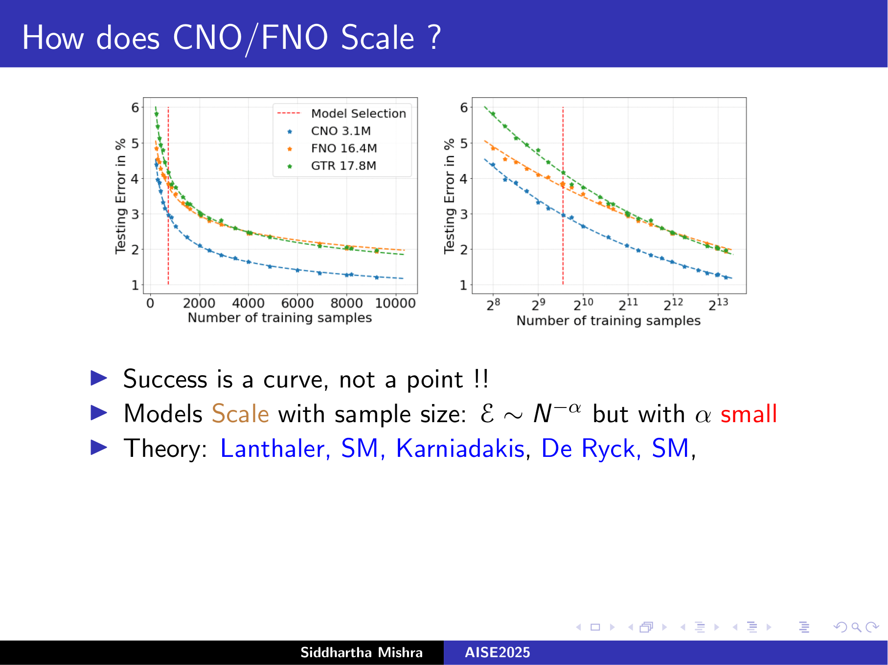

这就把问题推到一个更现实的目标：我们能不能让模型用更少的数据学到更稳的东西.

**#5 Attention as a Neural Operator：为什么它是 nonlinear kernel neural operator，它和 FNO/CNO 的差别是什么.**

Slides 把 self-attention 从 token 版本推到连续极限，得到一个 operator 形式：

$$
u(x)=A(v)(x)=W\int_D
\frac{\exp\left(\frac{\langle Qv(x),Kv(y)\rangle}{\sqrt{m}}\right)}
{\int_D \exp\left(\frac{\langle Qv(z),Kv(y)\rangle}{\sqrt{m}}\right){\rm d}z}
Vv(y)\,{\rm d}y.
$$

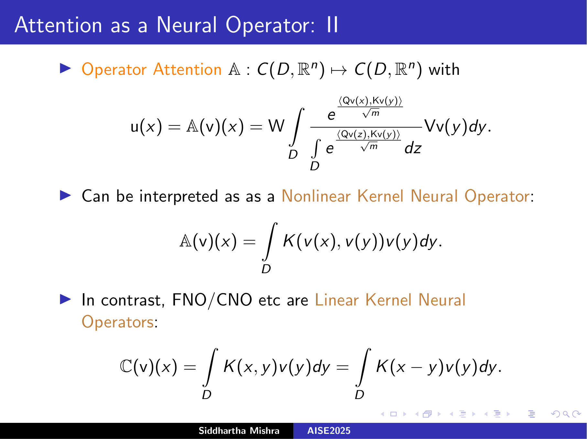

它可以被解释成

$$
A(v)(x)=\int_D K(v(x),v(y))v(y)\,{\rm d}y,
$$

也就是一个 **nonlinear kernel neural operator**: kernel 依赖于输入函数在 $x,y$ 处的取值.

对比之下，FNO/CNO 这类更接近

$$
C(v)(x)=\int_D K(x,y)v(y)\,{\rm d}y
$$

的 **linear kernel** 形式 (kernel 不依赖 $v$，只依赖坐标/相对坐标). 这不是说 attention 一定更好，而是在提醒我们，attention 的表达能力更强，但复杂度与可扩展性也会变得更尖锐.

**#6 为什么 vanilla transformer 对 2D/3D 不可行，ViT patching 与 windowed attention 分别在复杂度上解决了什么.**

Slides 对 vanilla transformer 的诊断是：计算成本对 token 数 $K$ 是二次的，粗略写成 $O(mnK^2)$. 2D/3D 输入一旦把每个网格点都当 token，$K$ 会爆炸，因此 "infeasible for 2 or 3-d inputs".

两条结构化改造路径分别是：

1) **ViT patching (patchification)：**把高分辨率图像切成 $p\times p$ 的 patch，每个 patch 变成一个 token，从而把 token 数从 $HW$ 级别降到 $N\approx (HW)/p^2$ 级别. 对应复杂度从 $O((HW)^2)$ 降到 $O((HW)^2/p^4)$.  
2) **Windowed attention：**把 attention 限制在局部 window 内，计算量不再按全局 token 两两交互增长；同时通过跨层 window shift 来让信息在更大范围传播.

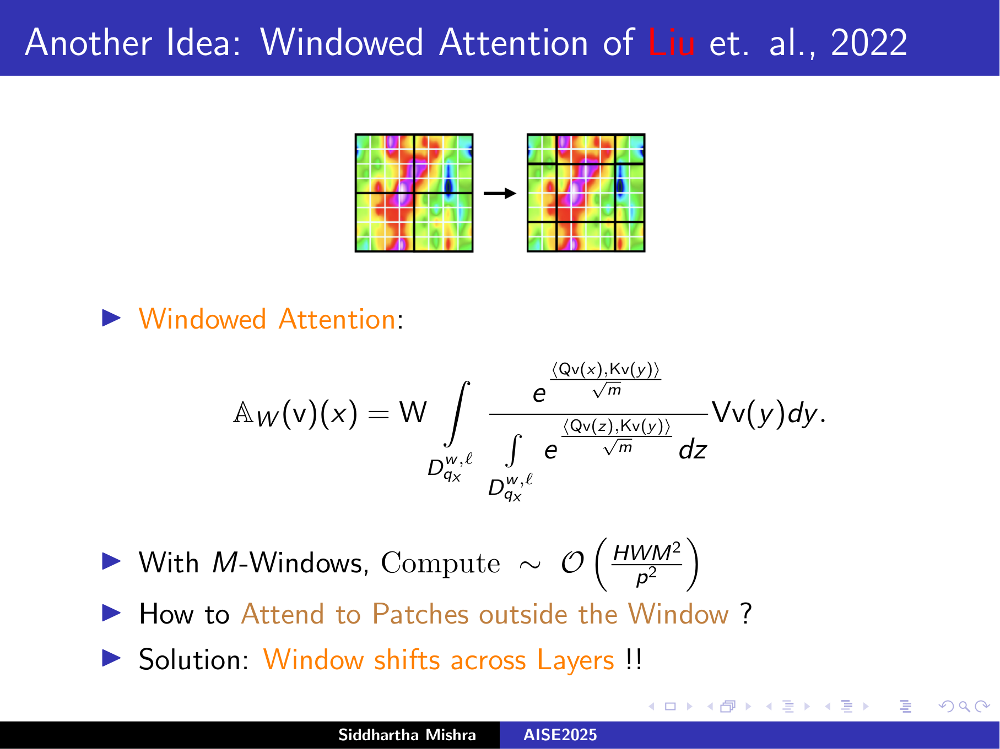

Slides 还给了一个例子：scOT (scalable Operator Transformer) 基于 Swin attention，并且宣称是 continuous operators 的 universal approximator. 我们可以把它理解成：它把 "attention 的表达力" 和 "operator learning 的可扩展性" 这两件事尽量对齐，但它并没有让 sample complexity 问题消失，只是把模型类换到另一条可能更有效的曲线.

**#7 两条 data efficiency 路线: physics-informed NO vs foundation model (Poseidon).**

路线 I: **Physics-informed neural operators (把 PDE residual 加进 loss).** Slides 写了一个联合目标：

$$
\sum_{i=1}^N\Big[\|\mathcal{S}(f_i)-\mathcal{S}_\theta(f_i)\|_Y+\lambda\|\mathcal{L}(\mathcal{S}_\theta(f_i))-f_i\|_Z\Big].
$$

直觉上这在做两件事：既拟合数据 $(f_i,\mathcal{S}(f_i))$ (也就是 $\{(f_i,\mathcal{S}(f_i))\}_{i=1}^N$ 这样的监督对)，又用 residual 强迫输出满足 PDE. 但 slides 紧接着给了一个负面证据，即 **"Not even for Simple problems"**，并用线性平流方程举例. 这里的主要风险是，PDE residual 并不会自动带来更好的 data efficiency，甚至可能引入优化与泛化层面的新问题.

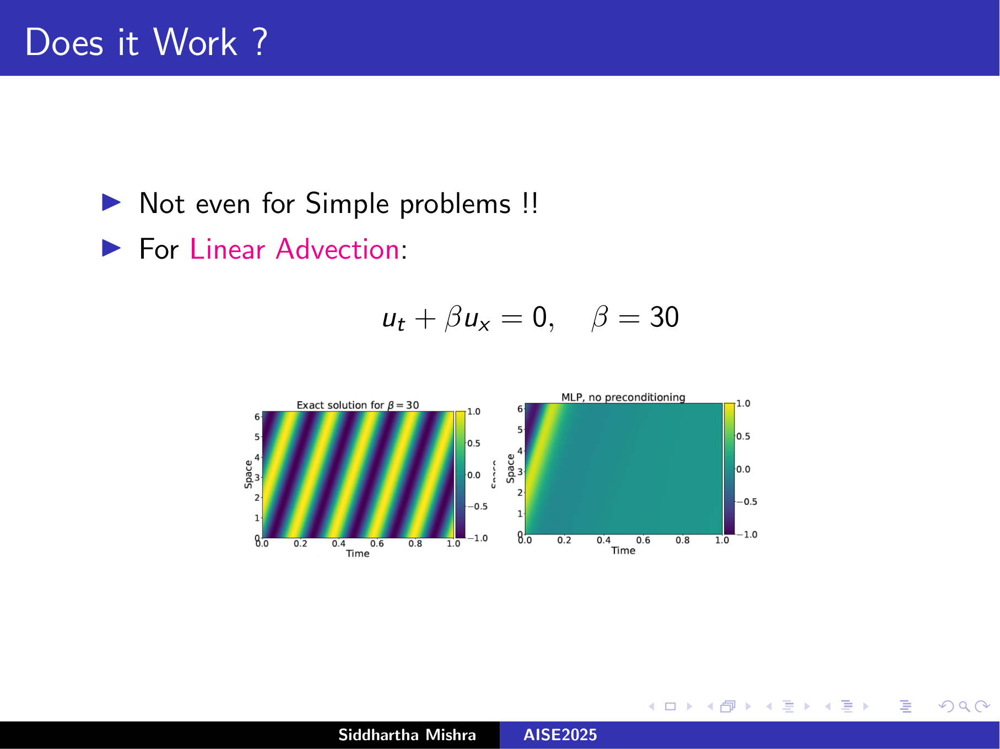

路线 II: **Foundation model，pretrain + finetune (Poseidon).** Slides 给出的证据链主要落在两类图上：

1) **Transfer latents vs frozen latents：**在相同的少样本条件下，transfer latents 的误差显著更低，这支持 "预训练学到的表征是可迁移的，而且允许迁移会更有收益".  
2) **Scaling curves：**随着 trajectory 数增加，Poseidon 系列模型的 error curve 与基线模型的差距提供了 "更 data efficient" 的证据.

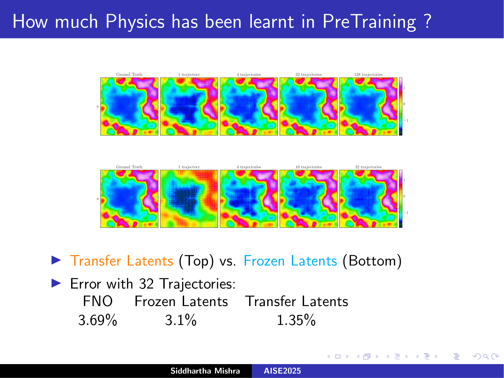

为了进一步支撑我们的结论，这里把 slides 的关键信息摘出来：

- **Transfer vs frozen 的对比：**在一个下游设定里，32 trajectories 时的误差对比是: FNO 3.69%，frozen latents 3.1%，transfer latents 1.35%. 这支持的结论是，预训练 latent 不是摆设，允许迁移能显著降低误差.  
- **Scaling 的对比：**Poseidon 的 scaling 曲线把它和 FNO、CNO、scOT 等 baselines 放在一起，展示 "更 data efficient" 的趋势 (尤其在小样本区间差距更明显).  
- **成本对比：**推理成本很低，但 PDEgym 数据生成可能要 $10^{-1}$ 到 $10^2$ 秒量级. 这会让 "用更强的预训练模型去省数据" 更有吸引力，因为数据才是贵的.

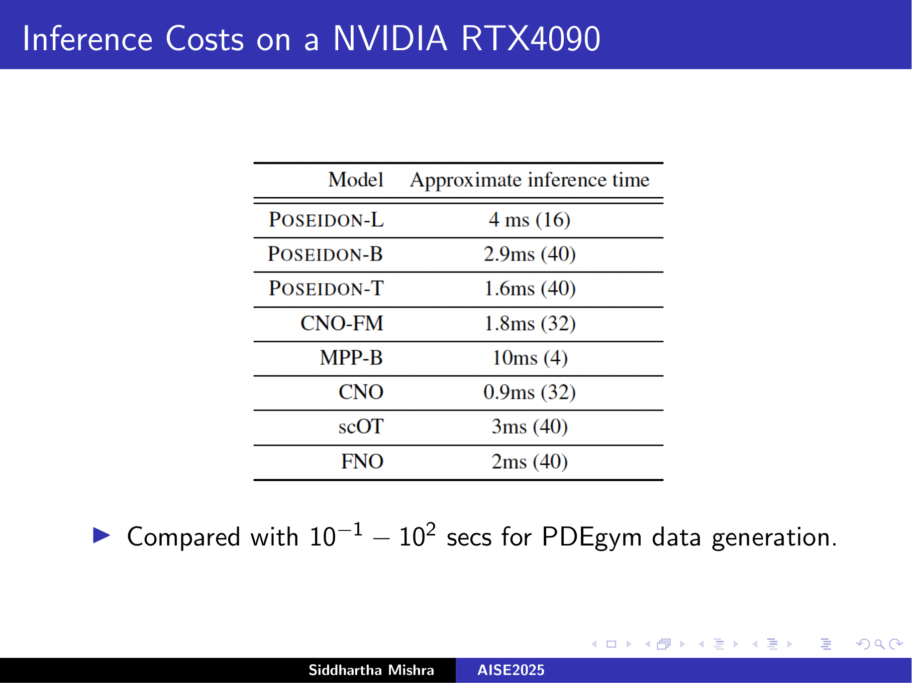

### Solution 7: time-dependent PDE 的 operator learning 目标应如何定义 (连续时间评估)，训练策略如何利用 semi-group 结构？

> **Evidence:** AISE25Lect9.pdf p.4-9，p.12; AISE25Lect12.pdf p.15.

**我们要回答什么：**time-dependent PDE 时，我们不是学一个静态的 $\mathcal{G}:X\to Y$，而是学一个随时间演化的 solution operator. Slides 的核心要求是：  
1) 把目标写成一个对任意 $t\in(0,T]$ 都能评估的算子 $\mathcal{S}(t,\bar u)$.  
2) 把训练策略与推理/评估对齐，尤其要搞清楚 "只在离散时间网格上做 rollout" 和 "连续时间评估 (含 OOD 时间点)" 的差别.

**结论：**Slides 给的框架很清楚：

- **定义：**对抽象 PDE $u_t+L(t,x,u)=0$，给定初值 $u(0)=\bar u$，solution operator 写成
  $$
  \mathcal{S}:(0,T)\times X\to X,\qquad \mathcal{S}(t,\bar u)=u(t).
  $$
- **半群性质：**对任意时间增量 $\Delta t$，
  $$
  \mathcal{S}(\Delta t,u(t))=u(t+\Delta t).
  $$
  这给了我们两件事：  
  (1) 轨迹数据的组织方式 (把一条 trajectory 拆成很多 "从当前态到未来态" 的子问题).  
  (2) all2all training 的样本构造 (用任意 $i<j$ 的 pair 来训练).
- **训练/推理三条路：**
  1) autoregressive rollout：定义一个固定步长的 next-step operator $NO_{\Delta t}$，反复迭代得到长时间预测，但会有误差累积且只在离散时间点 (time levels) 上评估.  
  2) time conditioning：把 lead time $\bar t$ 当作输入，直接学 $\mathcal{S}(\bar t,u(t))$，并用 conditional normalization 让网络参数显式依赖 $t$.  
  3) all2all training：用 $(u(t_i),u(t_j))$ 的所有 pair 训练 $\mathcal{S}(t_j-t_i,u(t_i))$，从而支持 "任意 $t>0$" 的评估，包含 OOD 时间点.

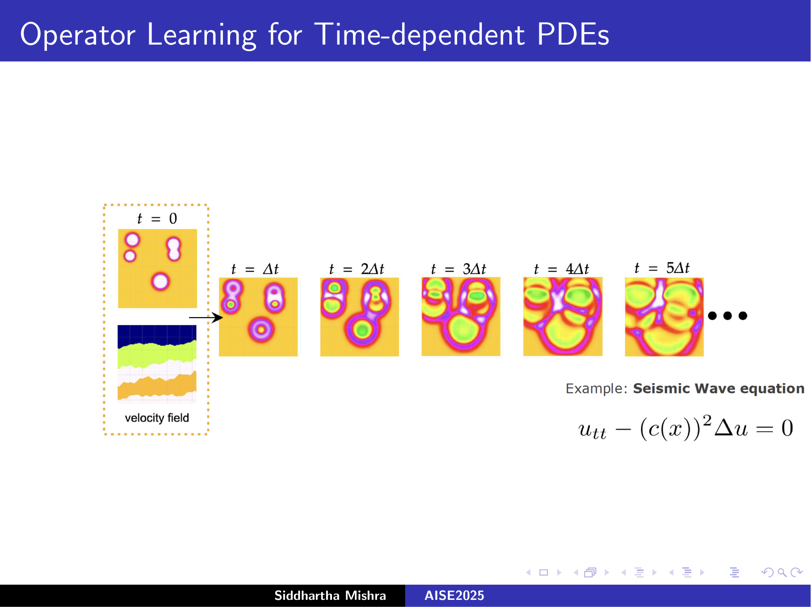

> **Note:** slides 用的词是 "Continuous-in-Time evaluations"，这里我们把它理解成 "连续时间评估"：我们希望模型的输出不是只在 $t_k$ 这些离散点上好看，而是能把 $t$ 当作一个连续变量来对齐与测试，尤其要能回答 "在没见过的时间点 $t$ 上，它到底靠谱不靠谱".

**#1 solution operator $\mathcal{S}(t,\bar u)=u(t)$ 与 $\mathcal{S}(\Delta t,u(t))=u(t+\Delta t)$ 在这里提供了什么结构.**

Slides 先把 time-dependent PDE 写成抽象形式：

$$
u_t + L(t,x,u)=0,\qquad u(0)=\bar u.
$$

然后把 "解 PDE" 改写成算子学习问题：

$$
\mathcal{S}:(0,T)\times X\to X,\qquad \mathcal{S}(t,\bar u)=u(t).
$$

关键结构是对任意时间增量 $\Delta t$，有

$$
\mathcal{S}(\Delta t,u(t))=u(t+\Delta t).
$$

我们可以把它理解成半群性质在数据层面的直接后果：一条 trajectory 不再只是 "从 $\bar u$ 到 $u(t_k)$ 的若干点"，它也隐含了很多子映射，例如从 $u(t_i)$ 走到 $u(t_j)$ 的映射，lead time 是 $t_j-t_i$. 这为后面的训练策略铺路.

**#2 autoregressive rollout 的公式是什么，slides 列出的 issues 在说什么.**

Slides 的 autoregressive evaluation 假设 trajectory 在均匀时间点上采样：$u(t_k)=u(k\Delta t)$. 然后定义一个 next-step 的 neural operator：

$$
NO_{\Delta t}(u(t_\ell))\approx u(t_\ell+\Delta t).
$$

长时间预测通过 rollout 得到：

$$
u(t_k)\approx \underbrace{NO_{\Delta t}\circ\cdots\circ NO_{\Delta t}}_{k\ {\rm times}}(\bar u).
$$

Slides 列的 issues 可以翻译成 4 个风险点：

1) **需要 uniform spacing：**训练与推理强绑定一个固定 $\Delta t$.  
2) **长 rollout 会带来训练问题：**要么只训 one-step，要么要训多步稳定性，都会变得更难.  
3) **误差累积：**one-step 小误差在多步迭代下会放大.  
4) **只在离散时间点 (time levels) 上评估：**你最多在 $t=k\Delta t$ 上能跑出值，但这不等价于 "连续时间评估".

**#3 time conditioning 的核心做法是什么，lead time 与 conditional normalization 分别在做什么.**

Slides 给的 time conditioning 版本是：把 lead time $\bar t$ 当成输入通道，直接学

$$
{\rm CNO}(\bar t, u(t))\approx \mathcal{S}(\bar t,u(t))=u(t+\bar t).
$$

这件事的直觉是：模型不再只学 "固定步长的下一步"，而是学 "任意 lead time 的推进算子". 这样就天然更贴近 "任意 $t$ 可评估".

但如果只是把 $\bar t$ 拼进输入，网络内部未必真的学会利用时间信息. Slides 的另一个关键设计是 **conditional normalization**：在每一层后加一个依赖 $t$ 的归一化/仿射变换. Slides 写的形式是：

$$
\mathcal{N}(w)=g_N(t)\odot\frac{w-\mathbb{E}(w)}{\sqrt{{\rm Var}(w)+\varepsilon}}+h_N(t),
$$

其中 $g_N,h_N$ 是关于 $t$ 的函数 (slides 说一般用 MLP，但 linear 也足够)，并且可以选择 instance / batch / layer normalization. 我们可以把它理解成一种显式的 "让模型参数随时间变化" 的机制.

> **Note:** 这条式子可以直观读成：把 normalization 的 scale/shift 变成 time-dependent. 先用 $\frac{w-\mathbb{E}(w)}{\sqrt{{\rm Var}(w)+\varepsilon}}$ 把中间特征 $w$ 标准化到相近的数值尺度，再用 $g_N(t)$ 与 $h_N(t)$ 做逐通道的缩放与平移 (这里 $\odot$ 是逐元素乘). 这样时间 $t$ 会在每一层都直接调节 feature 的统计量，比只把 $t$ 拼进输入更容易让网络真的用上时间信息.

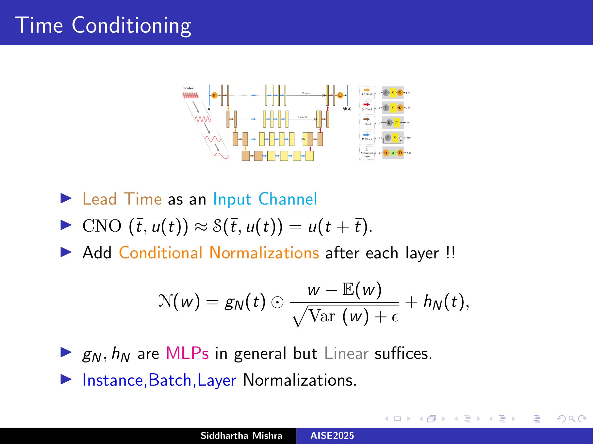

**#4 all2all training 的 input-target pairs 怎么写，为什么每条 trajectory 有大约 $(K^2+K)/2$ 个样本.**

Slides 先给了一个 "one at a time" 的训练方式：用 pair $(\bar u, \mathcal{S}(t_k,\bar u)=u(t_k))$ 训练. 如果一条 trajectory 有 $K+1$ 个时间点 $t_0=0,t_1,\dots,t_K=T$，那么每条 trajectory 贡献 $K$ 个样本 (对应 $k=1,\dots,K$).

all2all training 则利用半群性质，把每条 trajectory 变成所有 $i<j$ 的 pair：

$$
u(t_i),\qquad \mathcal{S}(t_j-t_i,u(t_i))=u(t_j),\qquad \forall i<j.
$$

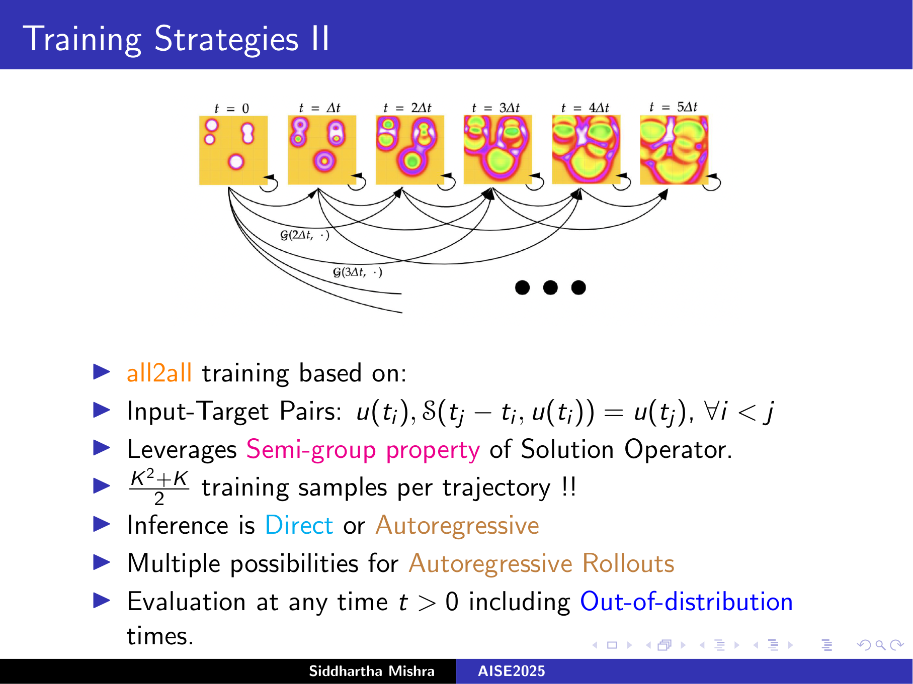

这会把每条 trajectory 的样本数从 $K$ 提升到大约

$$
\frac{K^2+K}{2}.
$$

> **Note:** 如果一条 trajectory 给了状态序列 $u(t_0),u(t_1),\dots,u(t_K)$ (共 $K+1$ 个时间点)，all2all 取所有 $i<j$ 的 pair. 计数时可以按 $j$ 来分组：对固定的 $j$，可选的 $i$ 有 $j$ 个，因此 pair 总数是 $\sum_{j=1}^K j = K(K+1)/2 = (K^2+K)/2$.

直觉上就是：$K$ 个时间点的两两组合数量是二次增长的. 这件事的关键收益是：模型在训练时就见过很多不同的 lead time，因此推理时更自然支持 "任意 $t>0$" 的评估.

**#5 什么叫连续时间评估与 OOD 时间点，它和离散时间网格评估的差别是什么.**

Slides 在开头就把 operator learning task 写成 "Continuous-in-Time evaluations"，并且写了目标表述：给定 $\bar u$ (加上边界条件)，生成整个轨迹 $u(t)$，对所有 $t\in(0,T]$.

这里的核心差别是：

- **离散时间网格评估：**只在 $t_k$ 这些训练/采样过的点上评估，模型看起来可能很好，但它可能依赖了时间离散化带来的偶然对齐.  
- **连续时间评估：**把 $t$ 当成连续变量，允许在任意 $t$ 评估，尤其包含 "没见过的时间点" (OOD 时间点). 这会更像一个真正的 solution operator 评估，而不是一个离散序列预测任务.

Slides 也提示 all2all training 的推理既可以 direct，也可以 autoregressive，并且允许 "evaluation at any time $t>0$ including out-of-distribution times". 这里我们可以把它理解成，all2all 给了更丰富的训练监督，从而让 OOD 时间点的评估变得更合理.

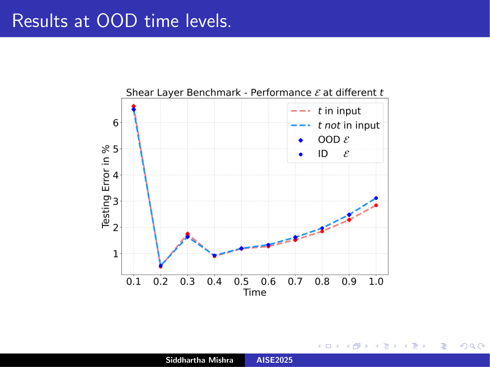

> **Note:** 这里说的 "时间对齐的训练样本"，指的是让每个样本都长成同一个输入-输出模板：输入是当前态 $u(t_i)$ 加上 lead time $\Delta t=t_j-t_i$，输出是未来态 $u(t_j)=\mathcal{S}(\Delta t,u(t_i))$. all2all training 就是在一条 trajectory 内把很多不同的 $(t_i,t_j)$ 都枚举出来，从而在训练阶段覆盖多种 $\Delta t$，更贴近我们要做的连续时间评估. Lect12 里 scOT 也强调 "with all2all training"，我们可以把它看作同一个信号：先把训练监督的时间结构组织对齐，再谈换更大的 backbone.

### Solution 8: 从 2D Cartesian domain 走向 arbitrary domains/unstructured grids 时，representation 与 model class 应该怎么选？

> **Evidence:** AISE25Lect10.pdf p.3-4，p.8，p.11，p.17-24，p.27-31; AISE25Lect9.pdf p.24，p.29.

**我们要回答什么：**之前的 neural operator 讨论默认隐含了一个前提，即 PDE 的定义域是 Cartesian domain，并且用 uniform grid 离散 (AISE25Lect10.pdf p.3). 但现实里很多 PDE 在 arbitrary domains 上，离散形式是 unstructured grids 或 point clouds (AISE25Lect10.pdf p.3). 因此我们要回答：当输入/输出不再是规则网格张量时，我们应该怎么选数据表示 (representation) 与模型类 (masking / DSE / GNN / GAOT/MAGNO)，以及这些路线在 accuracy / efficiency / scalability 上各自更合理的前提是什么.

**结论：**简单来说，slides 给的选型思路分三层：

1) **先选表示：**我们能不能把问题变回 Cartesian grid (masking)，或者我们必须面对 point cloud / mesh (DSE / GNN / GAOT).  
2) **再选交互结构：**我们想用 spectral 全局交互 (FNO-DSE) 还是图上的局部消息传递 (GNN / RIGNO).  
3) **最后看工程瓶颈：**纯 GNN 路线 (例如 RIGNO) 可以很准确，但 slides 明确提示它不高效，主要原因是 repeated sparse memory access (AISE25Lect9.pdf p.29; AISE25Lect10.pdf p.17). GAOT/MAGNO 用 encode-process-decode 把 point cloud 编码成 geometry-aware tokens，再用 transformer processor 做密集计算，目标是把 accuracy、efficiency、scalability 同时推上去 (AISE25Lect10.pdf p.18-24，p.27-31).

> **Note:** 这里的 "representation" 不是一个抽象概念，它直接决定了模型到底在做哪种计算：  
> - 若数据被表示成 $H\times W$ 的网格张量，那么 FFT/patching 等 dense 计算路线很自然.  
> - 若数据被表示成点集或 mesh，那么我们要么先把它变回某种 latent grid/token，要么就得接受 sparse neighbor aggregation 的代价.

**#1 核心限制是什么，为什么之前隐含了 "Cartesian domain + uniform grids".**

AISE25Lect10 开头把问题讲得很直接：之前的讨论 "only focussed on Cartesian Domains" 且 "Discretized with Uniform Grids" (AISE25Lect10.pdf p.3). 这对很多 neural operator (尤其是基于卷积或 Fourier 的家族) 是一个默认前提，因为它们的计算与参数共享方式都绑定了规则网格结构.

但现实 PDE 数据经常来自：
- **Arbitrary domains：**几何不规则，边界形状复杂.  
- **Unstructured grids / point clouds：**例如 FEM/FVM mesh 的节点与邻接关系，或者传感器/采样点云 (AISE25Lect10.pdf p.3).

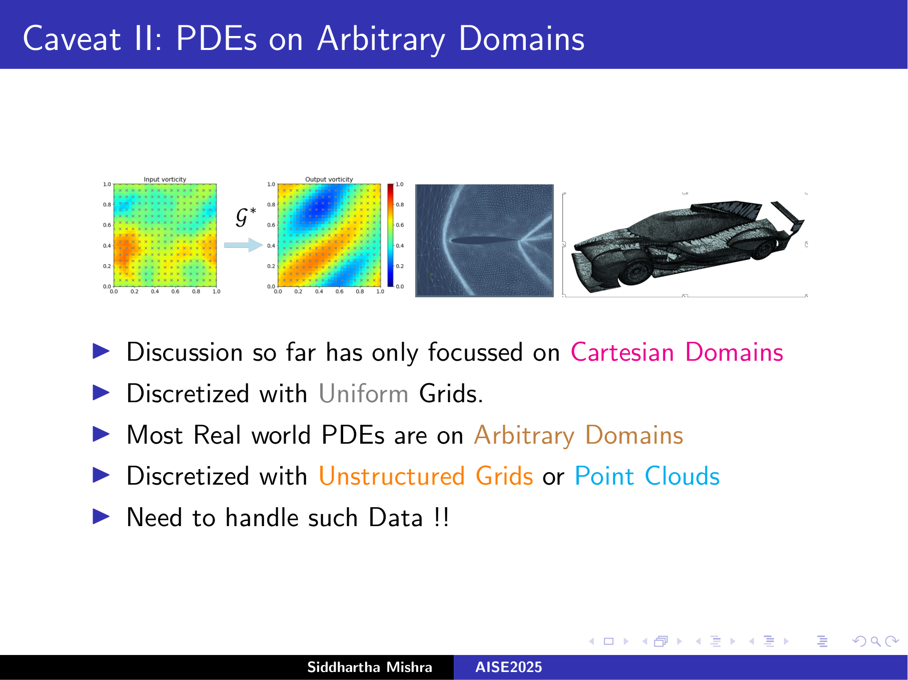

所以从这里开始，"怎么把几何与邻接关系编码进模型" 就变成主问题，而不仅是 "换一个更强的 kernel".

**#2 masking / DSE / GNN 三条路线各自假设输入输出是什么表示.**

Slides 在一页里把可用方法总结为三类 (AISE25Lect10.pdf p.4)：

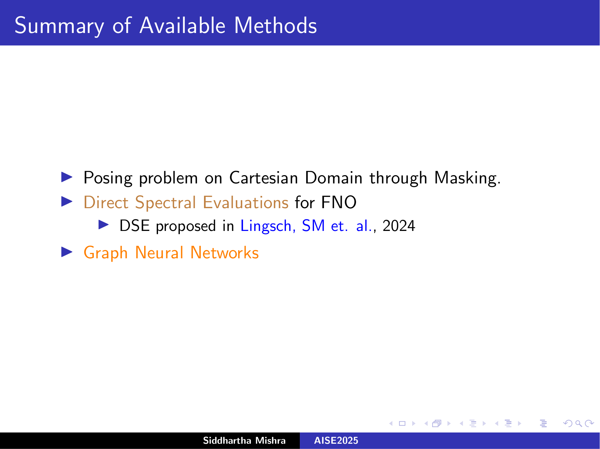

1) **Masking (把 arbitrary domain 变回 Cartesian).**  
   - **表示假设：**我们仍然用 Cartesian uniform grid 存场值，同时用一个 mask 标注哪些网格点属于真实物理域.  
   - **对应模型类：**继续用基于规则网格的模型 (例如 FNO/CNO/ViT operator 等).  
   - **直观权衡：**简单，能复用成熟实现. 代价是几何信息被粗粒度地塞进 mask，且很多计算可能浪费在域外网格上.

2) **DSE (Direct Spectral Evaluations for FNO).**  
   - **表示假设：**输入是 point cloud / unstructured points，但希望仍然走 spectral (FNO) 路线.  
   - **对应模型类：**FNO-DSE (slides 在方法总结里点名，并在 benchmark 表里单列 FNO-DSE) (AISE25Lect10.pdf p.4，p.12-15).  
   - **(待定) 细节：**Lect10 这里没有给出 DSE 的公式细节，我们只把它当作 "把 spectral 计算从 uniform grid 推广到点云" 的思路信号，不在 note 里补充超出 slides 的实现细节.

3) **GNN (Graph Neural Networks).**  
   - **表示假设：**数据以图来表示，节点是 mesh/point cloud 的点，边是邻接关系 (或 radius graph).  
   - **对应模型类：**基于 message passing 的 GNN operator，例如 RIGNO (AISE25Lect10.pdf p.11; AISE25Lect9.pdf p.24).  
   - **直观权衡：**表示最贴合 unstructured mesh，但计算通常是 sparse neighbor aggregation，工程上可能受 sparse memory access 限制.

> **Note:** 这三条路线可以理解为三种 "把几何塞进模型" 的方式: masking 把几何塞进输入通道，DSE 把几何塞进谱计算的求积/采样，GNN 则把几何塞进图结构与邻域聚合.

**#3 message passing 的 generic form 是什么，$v_i,N_i$ 在 PDE mesh 语境下对应什么.**

Slides 给出 message passing 的 generic form (AISE25Lect10.pdf p.8)：

$$
h_i := f\left(v_i,\,\bigoplus_{j\in N_i}\Psi(v_i,v_j)\right),
$$

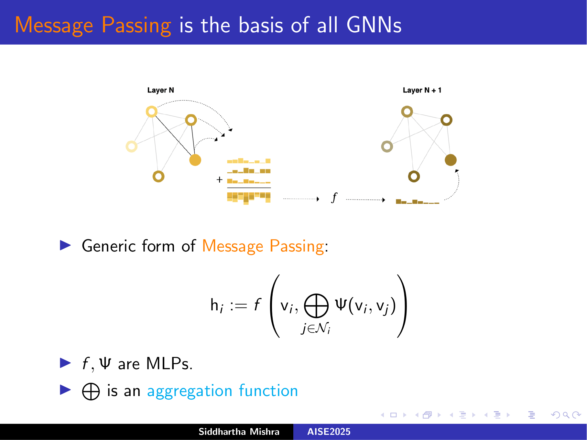

其中 $f,\Psi$ 是 MLP，$\bigoplus$ 是聚合算子 (例如 sum / mean / max).

在 PDE mesh 的语境下，我们可以把符号对上：

- $i$ 是一个 mesh node / point.  
- $v_i$ 是节点特征，例如 $a(x_i)$ 或 $u(x_i)$ 的局部场值，以及点坐标 $(x_i,y_i,...)$ 或其他几何 embedding.  
- $N_i$ 是邻居集合，来自 mesh connectivity (FEM 邻接) 或半径图 (local neighborhood).  
- $\Psi(v_i,v_j)$ 是从邻居 $j$ 传来的 message (可以含相对位移 $x_j-x_i$ 等几何信息).  
- 聚合后的 $h_i$ 是更新后的节点表示，用于下一层传播或用于输出.

**#4 RIGNO 的目标性质与主要权衡是什么.**

Slides 在 Lect9/Lect10 都用同一套措辞描述 **RIGNO** (AISE25Lect9.pdf p.24; AISE25Lect10.pdf p.11)：

- 基于 general MPNNs.  
- 为了 operator learning 任务做了多处修改，以确保：  
  1) **Multiscale information processing.**  
  2) **Temporal continuity.**  
  3) **Resolution invariance.**

同时 slides 也给出一个非常明确的工程结论：**RIGNO is very accurate but not efficient**，训练时间超过 2 天，并把主要原因归结为 repeated sparse memory access (AISE25Lect9.pdf p.29; AISE25Lect10.pdf p.17).

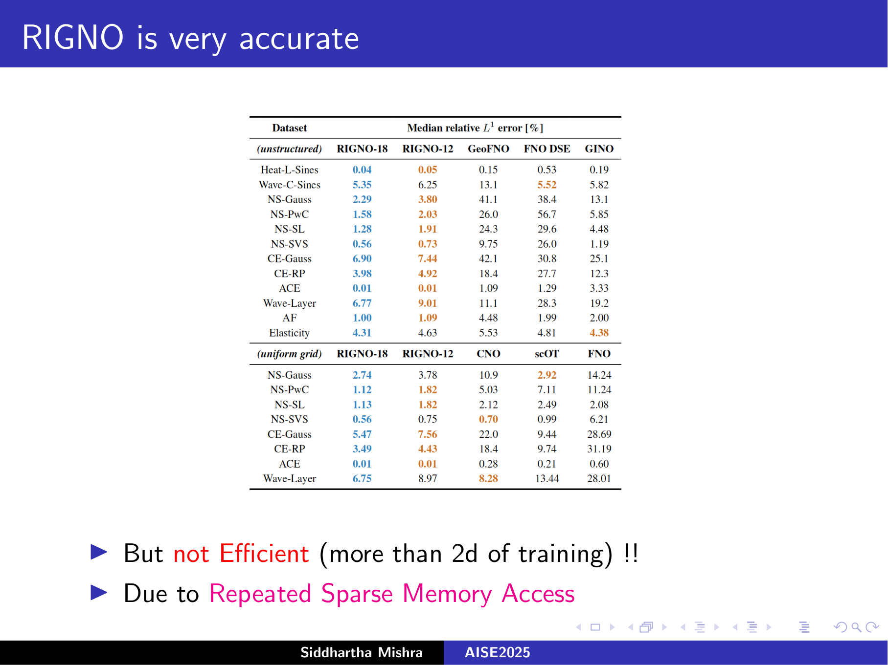

> **Note:** 我们可以把这段话理解成一个很具体的提醒：当输入规模变大 (节点数上百万) 时，"用 GNN 在稀疏邻接上反复做 message passing" 可能把瓶颈推到 memory access 上，而不是 FLOPs 上. 这会迫使我们考虑把表示改造成更适合 dense kernel 的形式.

**#5 GAOT/MAGNO 的 encode-process-decode 流程是什么，它试图用 graph + transformer 同时解决什么瓶颈.**

Slides 给出的主线是：既然纯 GNN 路线的瓶颈在 sparse memory access，那么一个自然的改法是 **Use Graphs + Transformers** (AISE25Lect10.pdf p.18). 具体到 GAOT/MAGNO，slides 强调的是 **encode-process-decode strategy** (AISE25Lect10.pdf p.19).

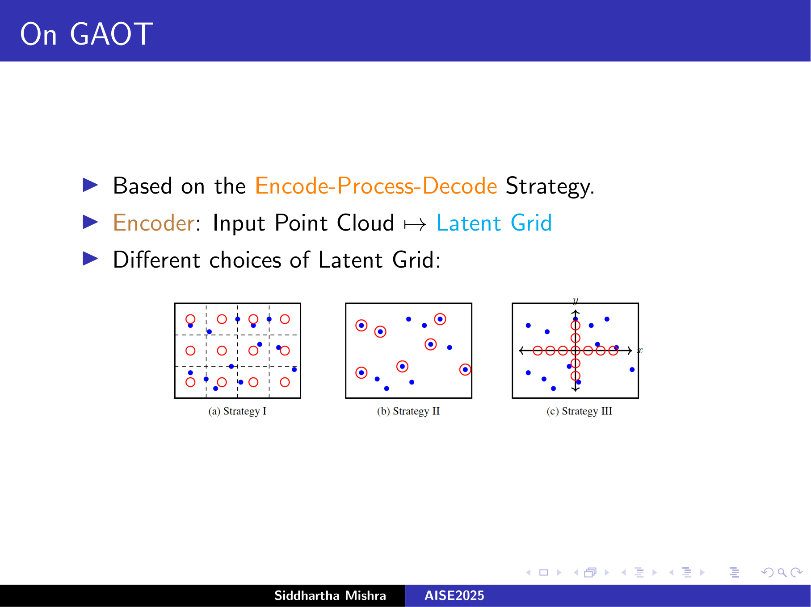

**(1) Encoder: Point cloud -> latent grid / geometry-aware tokens.**  
Slides 用一个局部聚合 + attention 加权的写法描述 encoder：对每个 latent 点 $y$，从半径邻域内的物理点 $x_k$ 聚合输入场 $a(x_k)$，并用 attention 选取 quadrature weights (AISE25Lect10.pdf p.20). 把关键结构抽出来，可以写成：

$$
w_e(y)=\sum_{|y-x_k|\le r}\alpha_k\,K(y,x_k,a(x_k))\,\phi(a(x_k)),
$$

其中 $K,\phi$ 是 MLP，$\alpha_k$ 由 attention 归一化得到. Slides 还写了 multi-scale aggregation：用多组半径 $r_m$ 聚合得到 $w_e^m(y)$，再用 softmax 权重 $\beta_m(y)$ 混合成最终 token (AISE25Lect10.pdf p.20，p.22).

几何信息的注入方式在 slides 里也被显式列出 (AISE25Lect10.pdf p.21): point coordinates，signed distance functions (SDFs)，以及一组 local statistical embeddings (邻居数，平均距离与方差，局部各向异性等). 这些信息共同服务于一个目标：让 encoder 输出的 tokens 对几何敏感，而不是把几何当作噪声.

**(2) Processor：在 latent 表示上用 transformer 做密集计算.**  
Slides 把 processor 画成一串 transformer blocks，并明确指出：  
- 若 latent grid 是 Cartesian 的，可以用 ViT 或 SWIN，从而允许 patching (AISE25Lect10.pdf p.23).  
- 若 latent grid 是 unstructured 的，则用标准 seq2seq transformer (AISE25Lect10.pdf p.23).

这一步的动机是把主要计算从 "稀疏邻域聚合" 转到 "dense token interaction"，从而更贴近现代硬件的实现优势.

**(3) Decoder: latent -> output field (可在任意 query point 评估).**  
Slides 强调 decoder "allows evaluation of output at any query point $y\in D$" 并把它称为 "Neural Field Property" (AISE25Lect10.pdf p.24). 这件事在选型上很关键：它把输出分辨率从训练时的 mesh 解绑出来，更像是在学一个连续场，而不是固定节点上的向量.

**(4) 结果与权衡: GAOT 的 accuracy / efficiency / scalability.**  
Slides 用 "GAOT combines best of both Worlds" 来概括整体结论，并明确写 "We can scale it to 3d Industrial Scale datasets" (AISE25Lect10.pdf p.28). 它还用三个 benchmark 强调输入规模与推理速度：

- DrivAerNet++: 0.5M nodes，CFD 375 node-hours vs. GAOT 0.36 seconds (AISE25Lect10.pdf p.29).  
- DrivAerML: 9M surface nodes，CFD 61K node-hours vs. GAOT 14 seconds (AISE25Lect10.pdf p.30).  
- NASA CRM aircraft: GAOT 在 surface pressure/skin friction 上与 GINO 对比给出更低的误差 (AISE25Lect10.pdf p.31).

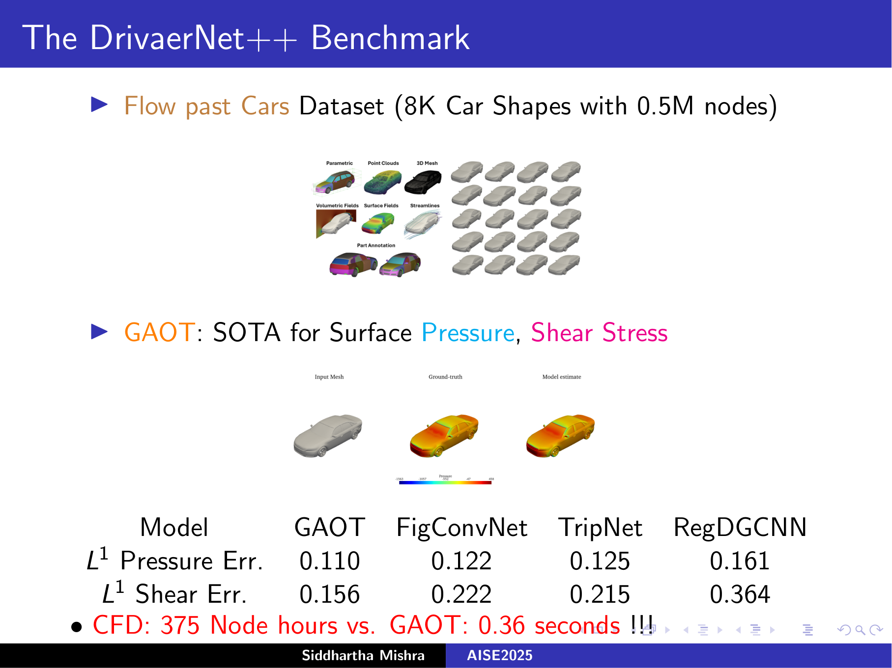

> **Note:** 这里我们不把这些数值当成 "方法论证明"，而把它当成 slides 的一个强信号：当问题进入 million-node 规模时，"先 tokenization，再 transformer" 这条路线被视为更可扩展的工程解法，而不仅是换一个更大的 GNN.

### Solution 9: 对 chaotic multiscale PDEs，为什么 "回归一个确定性解算子" 可能目标就不太合适 (应该学 conditional distribution)？

> **Evidence:** AISE25Lect11.pdf p.4-6，p.10-12，p.15-20.

**我们要回答什么：**Slides 在 Lect11 里强调一个 caveat：当 PDE 的解是 chaotic multiscale 的时候，直接用监督回归去学一个确定性的解算子 (给定 $u_0$ 输出一个 $u(t)$) 会出现典型失效模式，slides 把它称为 "collapse to mean" (AISE25Lect11.pdf p.5). 我们要把 slides 给的原因链条复述清楚，并解释为什么学习目标会从 deterministic operator 推向 conditional distribution $P(u(t)\mid u_0)$ (AISE25Lect11.pdf p.6). 最后，我们需要把 GenCFD 的训练目标写出来，并说明 slides 用哪些指标验证 "分布学对了" 与推理速度 (AISE25Lect11.pdf p.10-12，p.15-20).

**结论：**简单来说就两句话：

1) **对 chaotic multiscale PDE，确定性回归模型倾向于输出过度平滑的平均态 (collapse to mean).** Slides 给出一条解释链：神经网络的 insensitivity，训练中倾向 edge of chaos (Lip $\sim O(1)$)，再叠加 spectral bias 与 bounded gradients 的约束，会让模型很难表达 "小扰动 -> 大变化" 的混沌放大机制，最终预测会向平均态收缩 (AISE25Lect11.pdf p.5).  
2) **因此更合理的目标是直接学习条件分布 $P(u(t)\mid u_0)$，并用生成模型去采样这个分布.** Slides 以 statistical solutions 的观点出发，认为 "Only Statistical Computation is feasible"，并提出用 conditional score-based diffusion (GenCFD) 去逼近条件分布，结果用 mean/variance、point pdfs、spectra、Wasserstein distance 以及 runtime 对比来验证 (AISE25Lect11.pdf p.6，p.10-12，p.15-20).

> **Note:** 这里我们可以把 "collapse to mean" 当成一个非常具体的现象描述：模型的输出看起来像很多真实样本的平均，细节被抹平，高频能量偏少，同时预测分布的方差会被显著低估.

**#1 "Collapse to mean" 在预测输出里最直接的表现是什么.**

Slides 在 Taylor-Green vortex 的例子里用一组图来表达 "真实解是多样的" 与 "我们需要评估分布层面的性质"：

- **Samples:** kinetic energy / vorticity 的样本展示了小尺度结构随样本变化而变化 (AISE25Lect11.pdf p.13-14).  
- **Mean / Variance：**分别展示了条件分布的均值与方差场 (AISE25Lect11.pdf p.15-16).  
- **Point pdfs / Spectra：**在点位与频域上直接对比分布 (AISE25Lect11.pdf p.17-18).

下面两张图分别对应 Samples 与 Spectra.

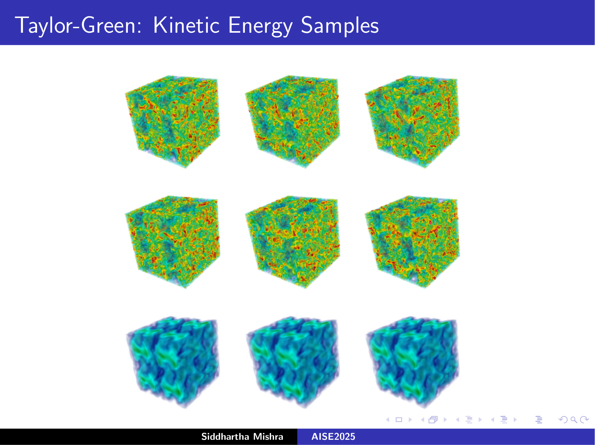

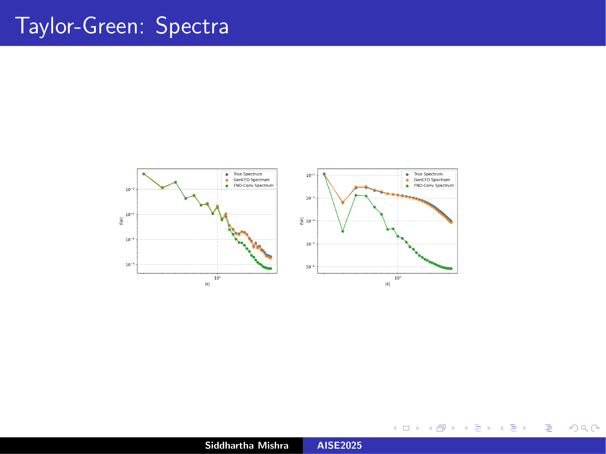

在这个语境下，"collapse to mean" 最直观的表现是：

1) **样本多样性消失：**预测更像某个单一的平均态，而不是不同 realization.  
2) **方差被低估：**如果模型本质上只输出一个 mean-like 的场，那么对应的 variance 近似会偏小 (甚至接近 0).  
3) **频谱过度衰减：**小尺度结构缺失会体现为高频能量被系统性压低 (AISE25Lect11.pdf p.18).

**#2 Slides 列出的 4 个点如何导向 "collapse to mean" (推理链).**

Slides 在一页里把原因写成 4 个点 (AISE25Lect11.pdf p.5)：

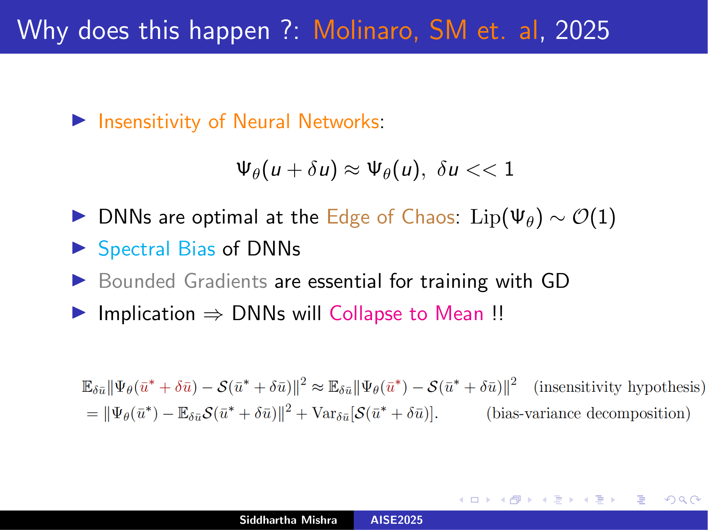

1) **Insensitivity：**$\Psi_\theta(u+\delta u)\approx \Psi_\theta(u)$，当 $\delta u\ll 1$.  
2) **Edge of chaos：**训练得到的 DNN 往往处于 "edge of chaos"，其 Lipschitz 常数 ${\rm Lip}(\Psi_\theta)\sim O(1)$.  
3) **Spectral bias：**DNN 更容易拟合低频成分.  
4) **Bounded gradients：**用 GD 训练时需要梯度有界.

我们把它们串起来，可以这样理解：

- chaotic PDE 的一个核心困难是：**微小初值扰动 $\delta u$ 会在时间演化后被放大成宏观差异**.  
- 但 (1)(2)(4) 共同把网络推向一个更 "不放大扰动" 的函数类：网络对小扰动不敏感，且 Lipschitz 常数被训练稳定性约束在 $O(1)$ 的量级.  
- 叠加 (3) 的 spectral bias，模型更倾向于用平滑的低频结构去解释数据.  

因此，在需要表达 "强敏感 + 多尺度" 的任务上，确定性 DNN 回归更容易收缩到一个更稳定的平均态，这就是 slides 用一句话概括的 "Implication $\Rightarrow$ DNNs will Collapse to Mean" (AISE25Lect11.pdf p.5).

> **Note:** 上面这段推理的重点不是某个定理，而是一个对齐：混沌系统需要放大微小差异，而可训练的神经网络倾向于不放大差异. 当两者对不上时，回归模型就会把不确定性 "平均掉".

**#3 为什么要把目标改成 conditional distribution $P(u(t)\mid u_0)$，它与 Problem 1 的 $\mathcal{G}_{\#}\mu$ 视角如何对齐.**

Slides 引用 statistical solutions 的观点，给出结论："Only Statistical Computation is feasible"，并把学习目标写成：直接近似条件分布 $P(u(t)\mid u_0)$ (AISE25Lect11.pdf p.6).

我们可以把这件事和 Problem 1 的语言对齐起来：

- 在 Problem 1 里，我们写过 $a\sim\mu$ 时输出分布是 $\mathcal{G}_{\#}\mu$. 这里强调的是：在数据驱动场景下，我们关心的是 **输出分布**，而不仅是某个点值预测.  
- chaotic multiscale 的场景进一步强化了这一点：即使给定同一个宏观初值 $u_0$，微观扰动或未解析尺度也会让 $u(t)$ 呈现一个分布，而不是一个单点. Slides 在 "Why should this Work" 页用
  $$
  {\rm Law}_{\delta \bar u}\big(\mathcal{S}(\bar u^\ast+\delta \bar u)\big)
  $$
  来提示这种 "由扰动推动的条件分布" 视角 (AISE25Lect11.pdf p.12).

  > **Note:** slides 这里的 ${\rm Law}_{\delta \bar u}(\cdot)$ 可以理解成：当微扰 $\delta \bar u$ 按某个分布抽样时，括号里这个随机变量在输出空间里诱导出的概率分布. 这句话想强调的不是某个具体分布形式，而是 "同一个宏观初值下，微观扰动会把输出推成一个分布" 这一层目标变化.

因此，把目标改成 $P(u(t)\mid u_0)$ 本质上是在说：我们不再要求模型给出唯一的 $u(t)$，而是要求它生成与真实动力系统一致的统计行为 (均值、方差、频谱、点分布等).

**#4 GenCFD 的训练目标是什么 (conditional score-based diffusion + denoiser objective)，conditioning 里包含哪些变量.**

Slides 给出的 GenCFD 关键描述是两句话 (AISE25Lect11.pdf p.10-11)：

- GenCFD 基于 **Conditional Score Based Diffusion Models**.  
- 用 reverse SDE 进行 denoising，训练一个 denoiser $D_\theta$，使其最小化
  $$
  \mathbb{E}\left\|u(t_n,\bar u)-D_\theta\big(u(t_n,\bar u)+\eta,\,\bar u,\,\sigma\big)\right\|.
  $$

我们把它翻译成更直白的描述就是：

1) 取一个时间 level $t_n$ 上的真实场 $u(t_n,\bar u)$.  
2) 给它加噪声：$u(t_n,\bar u)+\eta$ (噪声强度由 $\sigma$ 控制).  
3) 训练 $D_\theta(\cdot,\bar u,\sigma)$ 去把 noisy field denoise 回真实 field.

因此 slides 在符号层面明确的 conditioning 至少包含两项：**初值/条件 $\bar u$** 与 **噪声尺度 $\sigma$**. 时间 $t_n$ 在 slides 的写法里是通过 "我们正在 denoise 哪个 time slice" 来出现的；是否把 $t_n$ 显式作为额外输入，在 Lect11 的文字页里没有展开，这里不额外补充超出 slides 的设定.

**#5 Slides 用哪些指标验证生成分布的质量与推理速度，它们各自验证了什么.**

Slides 把验证分成两类：分布质量与推理速度.

**(1) 分布质量：先看结构性诊断，再看数值指标.**

- **Mean / Variance：**检查生成分布的一阶与二阶统计量是否匹配 (AISE25Lect11.pdf p.15-16).  
- **Point pdfs：**在固定点位上对比边缘分布的形状，检查 "是不是只学到均值附近" (AISE25Lect11.pdf p.17).  
- **Spectra：**在频域检查高频能量是否被系统性抹平 (AISE25Lect11.pdf p.18).

Slides 还给出一个数值指标面板，在 Taylor-Green 的 micro-macro setup 下比较 GenCFD、C-FNO 与 UViT 的指标 (AISE25Lect11.pdf p.19)：

- **Mean Error：**GenCFD 0.154，C-FNO 0.210，UViT 0.883.  
- **Std Error：**GenCFD 0.056，C-FNO 1.000，UViT 0.813.  
- **Wasserstein distance：**GenCFD 0.017，C-FNO 0.117，UViT 0.130.

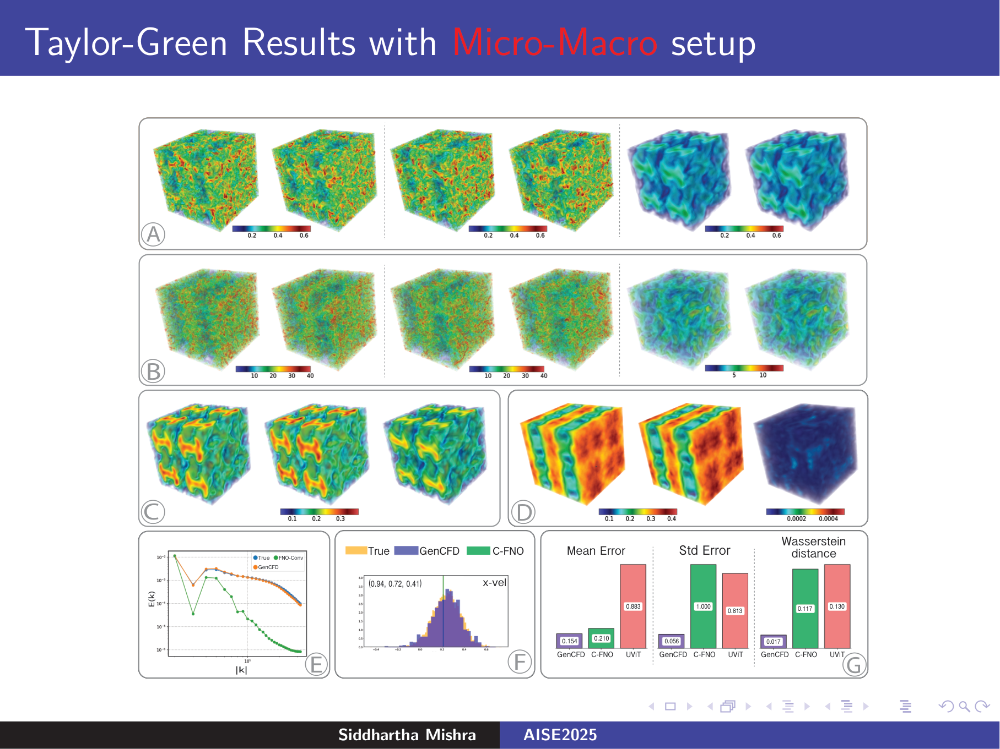

我们可以把这些指标各自对应到一个 "它在验证什么" 的解释上：

- mean error / std error：分别对应分布的一阶与二阶统计是否对齐.  
- Wasserstein distance：更像是一个整体的 distribution distance，用来衡量生成分布与真实分布的差距.

**(2) 推理速度：与数值模拟对比.**

Slides 在真实流动例子里直接给出 "simulator hours vs GenCFD seconds" 的对比 (AISE25Lect11.pdf p.20)：

- Nozzle Jet: 3.5 hrs (LBM) vs GenCFD 1.45s.  
- Cloud-Shock: 5 hrs (FVM) vs GenCFD 0.45s.  
- Conv. Boundary Layer: 13.3 hrs (FDM) vs GenCFD 3.8s.

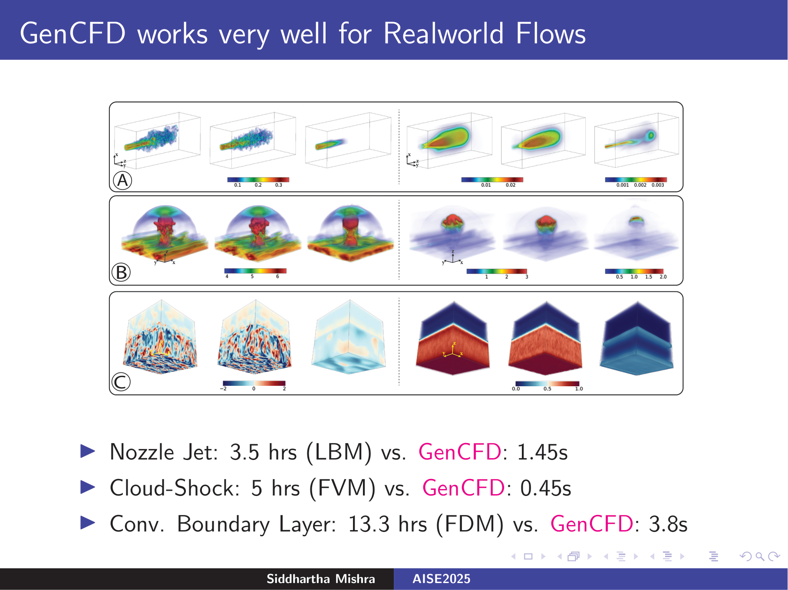

> **Note:** 这里的逻辑收束点是：对 chaotic multiscale PDE，"学分布" 不是为了更花哨，而是为了让学习目标与可计算性对齐. 当我们接受 "只能做统计预测" 这个前提时，生成式模型给了一个可行的近似路径，同时把推理速度拉到了和 surrogate 模型同一量级.

